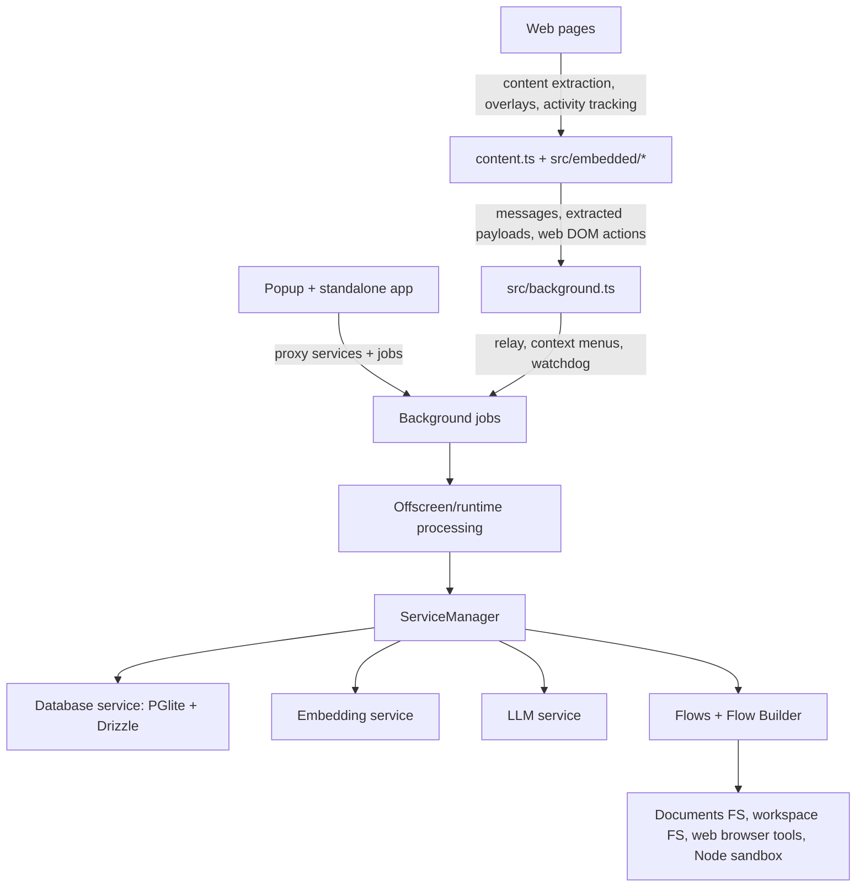

<div align="center">


# Memorall

### The browser is your agent's full workspace.

Memorall turns your browser into a local-first agent workspace with memory, tools, and model choice.

[](LICENSE)
[](https://extension.js.org)
[](https://www.typescriptlang.org/)
[](https://react.dev/)
[](https://github.com/zrg-team/memorall)
[](https://github.com/zrg-team/memorall)
[](https://github.com/zrg-team/memorall)
[](https://github.com/zrg-team/memorall)

[Quick Start](#quick-start) • [Agent Power](#agent-power) • [Custom Agents](#custom-agents) • [Architecture](#architecture-at-a-glance) • [Documentation](#documentation-map) • [GitHub](https://github.com/zrg-team/memorall)

</div>

## 🧠 Why Memorall

Memorall is built for people who do serious work in tabs. Instead of treating the browser as disposable context, it turns pages, selections, documents, and workspaces into durable memory that you can search, inspect, and chat with later.

What makes the current app distinctive:

- 🏠 Local-first by default. The app can run with in-browser runtimes such as Wllama, WebLLM, and Transformers, while still supporting OpenAI, OpenRouter, LM Studio, and Ollama when you want external or local server-backed models.
- 🤖 More than a chat window. The shipped UI includes a document library, topic system, knowledge graph explorer, model manager, debug tools, and advanced flow/activity surfaces.
- 🌐 Embedded where work happens. The content script can open a page-aware assistant, capture selected text, visible content, page HTML, and screenshots, and route saved content into a topic.
- ⚙️ Built for long-running work. Heavy operations are moved off the UI thread through background jobs, offscreen/runtime services, and proxy/main service pairs.
- 🔐 Privacy-aware. Supabase auth is optional, the core app can run local-only, and encrypted provider credentials are restored through the app's passkey flow.

<a id="agent-power"></a>
## ⚡ Agent Power

Memorall's agent is designed to be powerful on your machine, not just impressive in a demo.

- 🧪 Sandbox container access. The agent can use the browser-hosted sandbox runtime to execute Node.js code, install pnpm packages, work with files, start backend servers, and render UI/server output for iterative workflows such as Vite-style app work.
- 🌐 Browser access. The agent can open pages, keep an active browser session, inspect DOM state, search rendered HTML, wait for selectors, and perform DOM actions instead of working from raw text alone.
- 🧩 Custom flows and agents. The flow layer is not fixed to one canned assistant. Memorall ships configurable graph-based flows, feature steps, and a visual flow builder for custom agent behavior.
- 📁 Workspace access. The agent is not isolated from your knowledge base. It can work across the document library and writable workspace trees, giving it access to documents, notes, and workspace files.
- 🛠️ MCP integration is WIP. The repository already includes MCP adapter groundwork, but this should be treated as in-progress rather than a stable, documented feature today.

## Demo


## ✨ Core Capabilities

| Area | Capabilities |
| --- | --- |
| Chat workspace | Stream conversations, switch between chat and knowledge-aware flows, choose topics, manage agent settings, and inspect active runtime sessions for sandbox/browser tooling. |
| In-page assistant | Open an embedded chat overlay on any page, send selected text or extracted page context into chat, capture screenshots, and jump to the full app when needed. |
| Topic capture | Save selected content or full-page context into a topic from the page itself using the embedded topic selector. |
| Document library | Manage two trees: stored documents and writable workspace files. Upload/create/rename/move/delete/download files, preview PDFs/images/Excel, edit text/Markdown, and tag files with topics. |
| Knowledge conversion | Convert text, Markdown, PDF pages, and Excel sheets into topic-scoped knowledge graph data through the background job pipeline. |
| Knowledge graph | Explore nodes and edges in a D3 graph, filter by topic, search nodes, and curate graph data directly from the graph view. |
| Models and embeddings | Load local/browser models, connect remote providers, inspect current model status, and switch embedding sizes with live reload support. |
| Agent tooling | Let the agent use browser tools, filesystem-style tools, and sandbox runtime tools instead of responding with plain text only. |
| Diagnostics | Query the database, inspect vector similarity results, browse/export logs, and monitor long-running jobs from the UI. |
| Power-user routes | Use a visual flow builder and an activity timeline that can feed captured activity sessions back into AI analysis. |

## 🕸️ Memory And Knowledge Context

Memorall is not just a retrieval cache. It is meant to build an evolving memory context that the agent can follow over time.

- Topic-scoped knowledge graphs let the system keep relationships, facts, and sources grouped around what you are actually working on.
- Document-to-knowledge conversion turns notes, Markdown files, PDF pages, and Excel sheets into graph-ready context instead of leaving them as disconnected files.
- Hybrid retrieval combines structured storage, text matching, and embeddings so the agent can recall both exact facts and semantically related context.
- The result is a stronger "knowledge context" for the agent: not only what you saved, but what it means, how it connects, and where it came from.
- This makes the assistant better at staying aligned with your projects, vocabulary, past work, and long-running research threads.

<a id="custom-agents"></a>
## 🧩 Custom Agents

Memorall is not a fixed assistant — it is a foundation for building any agent you need.

Every agent is a **graph you fully own**: define any nodes, any flow logic, any tools, any conditions. Plug in new graphs, tools, or capability steps without touching existing code. Toggle features like web browsing, sandbox execution, or filesystem access per-agent at runtime.

The shipped graphs are examples of what the system can do, not the limit of what it supports.

→ Architecture and extension guide: [docs/customize-agents.md](./docs/customize-agents.md)

## 💾 Local-First Architecture

Offline-first in Memorall is architectural, not decorative. The product is fully functional without any external service.

- Local/browser-hosted model runtimes — Wllama, WebLLM, Transformers — are first-class citizens, not fallbacks.
- PGlite keeps the entire knowledge store in-browser; no server database required.
- Background jobs and offscreen services keep heavy embedding and LLM work local to the extension runtime.
- Supabase auth is optional. The app runs local-only by default; Supabase becomes available when configured.
- Remote providers — OpenAI, OpenRouter, LM Studio, Ollama — are available when you want them, not when you need them.
- Embedding sizes: small `384d`, medium `768d`, and large `1536d` (remote-backed).
- Storage: PGlite + Drizzle with vectors, migrations, topics, conversations, sources, nodes/edges, activities, and flow-builder state.

---

## 🗂️ Product Surfaces

### Main app surfaces

Routes currently wired in [`src/main/App.tsx`](./src/main/App.tsx):

- `/` - chat workspace
- `/documents` - document and workspace library
- `/knowledge-graph` - graph explorer
- `/llm` - model and provider management
- `/embeddings` - vector search/debug view
- `/database` - database inspector/query builder
- `/logs` - log viewer/export surface
- `/auth` - optional Supabase auth flow
- `/activities` - activity timeline and AI session analysis
- `/flow-builder` - visual flow authoring surface

### Embedded page surfaces

The content script and embedded pages provide two user-facing overlays:

- [`src/embedded/pages/EmbeddedChat.tsx`](./src/embedded/pages/EmbeddedChat.tsx) - a page-aware chat panel that can include selected text, visible content, full-page content, HTML structure, and captured images as context
- [`src/embedded/pages/TopicSelector.tsx`](./src/embedded/pages/TopicSelector.tsx) - a lightweight topic picker for saving page content into the knowledge system

### App shell

[`src/main/components/Layout.tsx`](./src/main/components/Layout.tsx) shows what the shared shell actually supports today:

- primary navigation for chat, documents, knowledge graph, and models
- a debug dropdown for embeddings, database, and logs
- theme switching
- English and Vietnamese UI switching
- embedding-size management
- process monitoring and standalone launch from popup mode
- optional account sign-in/sign-out

<a id="architecture-at-a-glance"></a>
## 🏗️ Architecture At A Glance



The runtime split in the current codebase is deliberate:

- UI surfaces use lightweight proxy services so popup and standalone stay responsive.
- heavy database, embedding, and LLM work runs in the runtime/offscreen side managed through [`src/services/service-manager.ts`](./src/services/service-manager.ts)
- cross-context execution goes through [`src/services/background-jobs`](./src/services/background-jobs)
- the MV3 background worker in [`src/background.ts`](./src/background.ts) stays thin: it registers listeners synchronously, manages context menus, relays browser work, and watches offscreen health

## 📦 Core `src/` Layout

```text
src/
  background.ts
  content.ts
  popup.tsx
  standalone.tsx
  background/          MV3 worker helpers, messaging, menus, watchdogs
  embedded/            in-page assistant, topic selector, extractors, trackers
  main/                React pages, modules, layout, auth, documents, chat UI
  services/            shared runtime services and infrastructure
    background-jobs/   cross-context job queue and handlers
    database/          PGlite, Drizzle schema, entities, migrations, RPC bridge
    embedding/         local and remote embedding implementations
    filesystem/        document/workspace virtual filesystem
    flows/             graph runtime, step/tool registry, flow builder catalog
    llm/               local/browser/API-backed model adapters
    sandbox-container/ browser-hosted execution runtime
    shared-storage/    cross-context shared state
    web-browser/       browser session and DOM automation service
```

If you want the shortest accurate mental model:

- [`src/main`](./src/main) is the user application
- [`src/embedded`](./src/embedded) is the page-integrated assistant/capture layer
- [`src/background`](./src/background) is the MV3 coordination layer
- [`src/services`](./src/services) is the real engine room

<a id="documentation-map"></a>
## 📚 Documentation Map

These are the current docs that match the codebase today:

### Architecture and services

- [Services overview](./docs/services.md)
- [Background jobs](./docs/background-jobs.md)
- [Shared storage](./docs/shared-storage.md)
- [Database service](./docs/database-service.md)
- [Embedding service](./docs/embedding-service.md)
- [LLM service](./docs/llm-service.md)
- [Flows service](./docs/flows-service.md)
- [Customize agents](./docs/customize-agents.md)

### Knowledge system

- [Knowledge graph service and flow](./docs/knowledge-graph-service.md)
- [Knowledge RAG flow](./docs/knowledge-rag-service.md)
- [Smart retrieval notes](./docs/graph/smart_retrieval.md)
- [MMR usage notes](./docs/graph/mmr_usage.md)

### Auth, storage, and migration

- [Supabase docs index](./docs/supabase/index.md)
- [Supabase quickstart](./docs/supabase/quickstart.md)
- [Supabase setup](./docs/supabase/setup.md)
- [Supabase implementation](./docs/supabase/implementation.md)
- [Migration notes](./docs/migration.md)

Notes about stale docs from older README versions:

- `knowledge-pipeline.md` has been replaced by [`docs/knowledge-graph-service.md`](./docs/knowledge-graph-service.md)
- `remember-service.md` no longer exists as a standalone current doc

<a id="quick-start"></a>
## 🚀 Quick Start

```bash
git clone https://github.com/zrg-team/memorall.git
cd memorall
pnpm install
```

Then:

1. Create `.env` from `.env.example`.
2. Set `CHROME_PATH` if you want to use `pnpm run dev`.
3. Optionally add Supabase keys, or configure Supabase later through the app.
4. Build or run the extension.

Recommended Chrome build flow:

```bash
pnpm run build:chrome
```

Load the unpacked extension from `dist/chrome`.

If you want live development:

```bash
yarn run dev
```

## 🛠️ Development Commands

| Command | Purpose |
| --- | --- |
| `yarn run dev` | Hot-reload development build for Chromium (`CHROME_PATH` required). |
| `yarn run build` | Default production build. |
| `yarn run build:chrome` | Build Chrome MV3 output in `dist/chrome`. |
| `yarn run build:edge` | Build Edge MV3 output. |
| `yarn run build:firefox` | Build Firefox MV3 output. |
| `yarn run build:all` | Build Chrome, Edge, and Firefox outputs. |
| `yarn run type-check` | Run TypeScript without emitting files. |
| `yarn run lint` | Run the Extension.js lint step. |
| `yarn run format` | Format `src` and `scripts` with Biome. |
| `yarn run package` | Build the publish/package output. |

## 🤝 Contributing

Issues and pull requests are welcome at [github.com/zrg-team/memorall](https://github.com/zrg-team/memorall).

When contributing, it helps to understand the runtime split first:

- UI and interaction work usually lives in [`src/main`](./src/main) or [`src/embedded`](./src/embedded)
- extension wiring lives in [`src/background`](./src/background), [`src/background.ts`](./src/background.ts), and [`src/content.ts`](./src/content.ts)
- anything stateful or heavy likely belongs in [`src/services`](./src/services)

## 📄 License

Memorall is licensed under the [MIT License](LICENSE).

<div align="center">

Built on Extension.js, React, TypeScript, PGlite, and browser-native AI runtimes.

</div>
