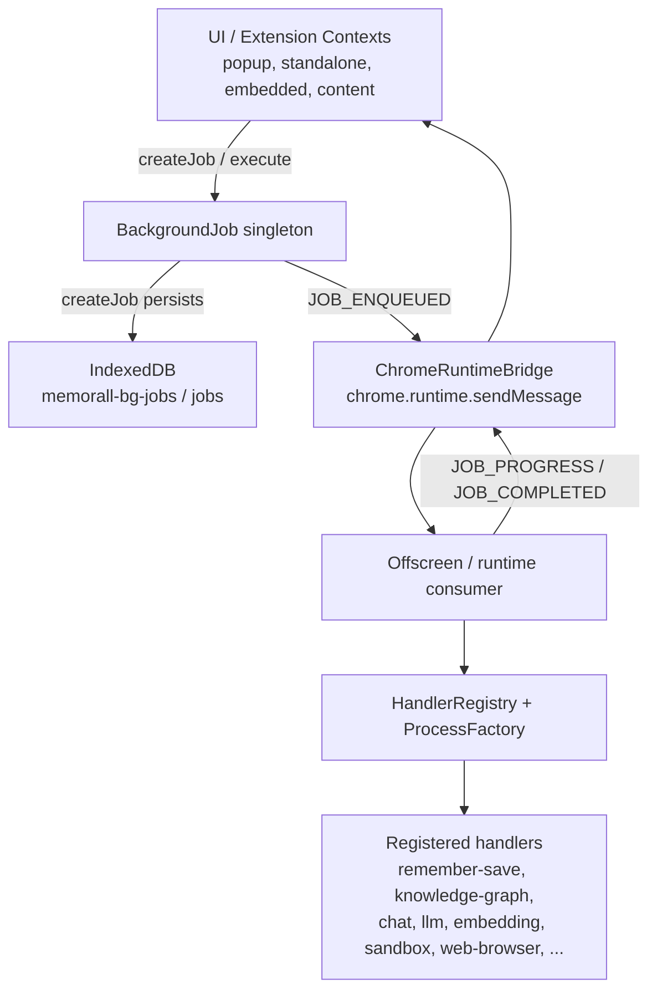

# 🧵 Background Jobs Documentation

## 📋 Overview

The Background Jobs module is a cross-context execution facade for Memorall. It lets popup, embedded, background, and content-script code submit typed jobs, observe progress, and receive final results while routing work toward the offscreen/runtime processing side.

Within `src/services/background-jobs`, the system is split into four parts:

- **`background-job.ts`**: singleton API for creating jobs, streaming progress, resolving completion promises, exposing queue listeners, and tracking offscreen initialization progress
- **`idb-job-store.ts`**: IndexedDB-backed persistence for queued jobs
- **`bridges/*`**: Chrome runtime messaging bridge for cross-context notifications
- **`handlers/*`**: typed job handlers, registry, and factory helpers

The module supports two submission styles:

- **`createJob()`**: creates a persisted queued job record in IndexedDB before notifying the processing side
- **`execute()`**: dispatches a job immediately without first storing it in IndexedDB on the caller side

## 🏗️ Architecture

### 🔧 Cross-Context Communication



### 📦 Module Architecture

- **BackgroundJob**
  - owns the singleton instance exported as `backgroundJob`
  - tracks completion listeners and progress streams per job ID
  - normalizes progress updates for persisted jobs
  - exposes `initializeServices()` for offscreen startup progress
- **IdbJobStore**
  - stores queued jobs in `memorall-bg-jobs`
  - object store: `jobs`
  - indexes: `status`, `createdAt`
- **ChromeRuntimeBridge**
  - detects context: `background`, `offscreen`, `popup`, or `content`
  - sends runtime messages directly between extension contexts
  - background is expected to relay `content` / `all` messages to content scripts
- **HandlerRegistry / ProcessFactory**
  - handlers self-register by job type
  - `ProcessFactory` wraps handler execution with standard start/completion/failure progress updates
- **`handlers/index.ts`**
  - imports each handler file for side-effect registration

### 📨 Notification Message Types

The bridge currently uses these runtime message types:

- `JOB_ENQUEUED`
- `JOB_UPDATED`
- `JOB_PROGRESS`
- `JOB_COMPLETED`
- `QUEUE_UPDATED`

### 🗂️ Queue State Model

Queued job state is derived from IndexedDB and exposed to listeners as:

```typescript
interface JobQueueState {
  jobs: Record<string, BaseJob>;
}
```

Important runtime behavior:

- `createJob()` jobs are written to IndexedDB immediately
- `execute()` jobs are not written to IndexedDB by `background-job.ts`
- `subscribe()` and `getAllJobs()` only reflect persisted queued jobs
- `completeJob()` deletes completed queued jobs from IndexedDB immediately, so queue snapshots represent in-flight jobs rather than historical completed work

## 🎯 Execution Modes

### 1. 🚀 `createJob()` - Persisted queued job

`createJob()` creates a `BaseJob`, stores it in IndexedDB, notifies listeners, and sends a `JOB_ENQUEUED` bridge message to the offscreen target.

```typescript
const { promise } = await backgroundJob.createJob(
  "remember-save",
  {
    sourceType: "user_input",
    title: "My Note",
    textContent: "Important information",
  },
  { stream: false },
);

const jobResult = await promise;
```

**Characteristics**

- Persists the job record in IndexedDB on the caller side
- Appears in `subscribe()` snapshots and `getAllJobs()`
- Stores progress history on the job while it is active
- Removes the job from IndexedDB on successful completion via `completeJob()`
- Best when you want queue visibility or a persisted in-flight record

### 2. ⚡ `execute()` - Direct dispatch

`execute()` creates an in-memory `BaseJob` object and immediately sends it across the bridge without first storing it in IndexedDB.

```typescript
const { promise } = await backgroundJob.execute(
  "text-to-vector",
  { text: "hello world" },
  { stream: false },
);

const jobResult = await promise;
```

**Characteristics**

- Skips `saveJob()` in `background-job.ts`
- Does not appear in queue state snapshots on the caller side
- Still supports promise-based completion and progress streaming
- Best for request/response style work where queue persistence is not required

## 🛠️ Available Job Types & Handlers

### 📚 Remember & Knowledge

- **`remember-save`**
  - saves page/content data to the document filesystem
  - special-cases `sourceType: "selection"` by delegating into `knowledge-graph`
- **`knowledge-graph`**
  - converts text/page content into knowledge graph data

### 🧪 Basic Test Handlers

- **`basic-async`**
- **`basic-stream`**

### 🔢 Embedding Operations

- **`text-to-vector`**
- **`texts-to-vectors`**
- **`create-embedding`**
- **`get-embedding`**
- **`initialize-embedding-service`**
- **`reload-embedding-model`**

### 🦙 LLM, Model, and Auth Operations

- **`get-current-model`**
- **`get-all-models`**
- **`get-models-for-service`**
- **`get-max-model-tokens`**
- **`get-max-response-tokens`**
- **`serve-model`**
- **`unload-model`**
- **`delete-model`**
- **`create-llm-service`**
- **`chat-completion`**
- **`restore-auth-provider`**
- **`restore-all-providers`**
- **`remove-auth-provider`**
- **`detect-system-specs`**
- **`check-provider-needs-restore`**

### 💬 Chat

- **`chat`**
  - supports normal, agent, and knowledge chat modes
  - streams partial output and action metadata through progress updates

### 🏷️ Topic & Flow Discovery

- **`check-topics-exist`**
- **`get-topics`**
- **`get-predefined-flows`**

### 📈 Activity Tracking

- **`activity-start-session`**
- **`activity-stop-session`**
- **`activity-record`**
- **`activity-get-sessions`**
- **`activity-get-activities`**
- **`activity-delete-session`**
- **`activity-get-stats`**

### 🧰 Sandbox Operations

- **`sandbox-operation`**
  - the `operation` field selects the actual sandbox action

Supported sandbox operations currently include:

- Runtime: `health`, `runtime.executeCode`, `runtime.runFile`, `runtime.createRepl`, `runtime.replEval`, `runtime.getLogs`, `runtime.clearLogs`, `runtime.reset`
- Network: `network.fetch`
- Filesystem: `fs.writeFile`, `fs.readFile`, `fs.mkdir`, `fs.readdir`, `fs.unlink`, `fs.rename`, `fs.exists`, `fs.mountDocuments`, `fs.materializeDocumentFile`, `fs.mountWorkspace`, `fs.materializeWorkspaceFile`, `fs.flushWorkspaceWrites`
- Package management: `npm.install`, `npm.installFromPackageJson`, `npm.list`
- Server lifecycle: `server.start`, `server.stop`, `server.list`, `server.request`, `server.renderUrl`, `server.handleSwRequest`
- Snapshots: `snapshot.get`, `snapshot.restore`

### 🌐 Web Browser Operations

- **`web-browser-operation`**
  - the `operation` field selects the actual browser action

Supported browser operations currently include:

- Session lifecycle: `session.open`, `session.refresh`, `session.getOrOpen`, `session.close`, `session.disposeActive`, `session.getActiveInfo`
- Content and DOM: `content.fetchRenderedFallback`, `dom.query`, `dom.action`
- Search and waiting: `search.findInPage`, `wait.selector`, `wait.render`

## 📚 Usage Examples

### 🚀 Queued Processing

```typescript
import { backgroundJob } from "@/services/background-jobs/background-job";

const { promise } = await backgroundJob.createJob(
  "remember-save",
  {
    sourceType: "user_input",
    title: "Meeting Notes",
    textContent: "Summarize the Q1 planning discussion",
  },
  { stream: false },
);

const jobResult = await promise;

if (jobResult.status === "completed") {
  console.log("Saved file:", jobResult.result?.filePath);
} else {
  console.error("Save failed:", jobResult.error);
}
```

### ⚡ Direct Processing

```typescript
const { promise } = await backgroundJob.execute(
  "text-to-vector",
  { text: "Convert this text into an embedding" },
  { stream: false },
);

const jobResult = await promise;

if (jobResult.status === "completed") {
  console.log("Vector length:", jobResult.result?.vector.length);
}
```

### 📊 Progress Streaming

```typescript
const { stream } = await backgroundJob.createJob(
  "knowledge-graph",
  {
    filePath: "note-123",
    content: "Alice met Bob at the conference.",
  },
  { stream: true },
);

for await (const event of stream) {
  console.log(event.status, event.progress, event.stage);

  if (event.status === "failed") {
    console.error(event.error);
    break;
  }

  if (event.status === "completed") {
    console.log("Completed with result:", event.result);
  }
}
```

### 👀 Queue State Monitoring

```typescript
const unsubscribe = backgroundJob.subscribe((state) => {
  const jobs = Object.values(state.jobs);
  console.log("Queued jobs:", jobs.length);

  for (const job of jobs) {
    console.log(job.id, job.jobType, job.status);
  }
});

const activeJobs = await backgroundJob.getAllJobs();
console.log("Current persisted jobs:", activeJobs.length);

// Later
unsubscribe();
```

## 🎯 Job Handler Development

### 📋 Handler Structure

Handlers in this module generally follow this pattern:

```typescript
import { BaseProcessHandler } from "./base-process-handler";
import { backgroundProcessFactory } from "./process-factory";
import type { BaseJob, ProcessDependencies, ItemHandlerResult } from "./types";

const JOB_NAMES = {
  myOperation: "my-operation",
} as const;

export interface MyOperationPayload {
  input: string;
}

export interface MyOperationResult extends Record<string, unknown> {
  output: string;
}

type MyJob = BaseJob & {
  jobType: (typeof JOB_NAMES)[keyof typeof JOB_NAMES];
  payload: MyOperationPayload;
};

declare global {
  interface JobTypeRegistry {
    "my-operation": MyOperationPayload;
  }

  interface JobResultRegistry {
    "my-operation": MyOperationResult;
  }
}

class MyHandler extends BaseProcessHandler<MyJob> {
  async process(
    jobId: string,
    job: MyJob,
    dependencies: ProcessDependencies,
  ): Promise<ItemHandlerResult> {
    await this.addProgress(jobId, "Starting...", 10, dependencies);

    const output = job.payload.input.toUpperCase();

    await this.addProgress(jobId, "Done", 90, dependencies);

    return this.createSuccessResult({ output });
  }
}

backgroundProcessFactory.register({
  instance: new MyHandler(),
  jobs: Object.values(JOB_NAMES),
});
```

### 🔄 Progress Updates

`BaseProcessHandler` provides `addProgress()` to create timestamped progress events:

```typescript
await this.addProgress(
  jobId,
  "Processing step 2 of 5",
  40,
  dependencies,
  { currentStep: "validation" },
);
```

If you implement `ProcessHandler` directly instead of extending `BaseProcessHandler`, call `dependencies.updateJobProgress()` yourself.

## 📝 API Reference

### 🧰 Core Submission API

```typescript
initialize(): Promise<void>

createJob<T extends keyof JobTypeRegistry>(
  jobType: T,
  payload: JobTypeRegistry[T],
  options: { stream: true }
): Promise<JobStreamResult>

createJob<T extends keyof JobTypeRegistry>(
  jobType: T,
  payload: JobTypeRegistry[T],
  options: { stream: false }
): Promise<JobPromiseResult<T extends keyof JobResultRegistry ? T : never>>

execute<T extends keyof JobTypeRegistry>(
  jobType: T,
  payload: JobTypeRegistry[T],
  options: { stream: true }
): Promise<JobStreamResult>

execute<T extends keyof JobTypeRegistry>(
  jobType: T,
  payload: JobTypeRegistry[T],
  options: { stream: false }
): Promise<JobPromiseResult<T extends keyof JobResultRegistry ? T : never>>
```

### 🔍 Queue and Lifecycle API

```typescript
subscribe(listener: (state: JobQueueState) => void): () => void
getJob(jobId: string): Promise<BaseJob | null>
getAllJobs(): Promise<BaseJob[]>
clearCompletedJobs(): Promise<void>

initializeServices(): Promise<
  AsyncIterable<{ stage: string; progress: number; status: string }>
>
```

### 🔌 Runtime Integration API

These methods are public on `BackgroundJob`, but they are primarily runtime/infrastructure hooks rather than typical UI entry points:

```typescript
getNotificationBridge(): IJobNotificationBridge
subscribeToJobCompletion(jobId: string, callback: (result: JobResult) => void): void
updateJobProgress(jobId: string, progress: JobProgressUpdate): Promise<void>
completeJob(jobId: string, result: JobResult): Promise<void>
```

### 📊 Result Types

```typescript
type JobStatus = "pending" | "processing" | "completed" | "failed";

interface JobStreamResult {
  jobId: string;
  stream: AsyncIterable<JobProgressEvent>;
}

interface JobPromiseResult<T extends keyof JobResultRegistry = keyof JobResultRegistry> {
  jobId: string;
  promise: Promise<JobResultFor<T>>;
}

interface JobProgressEvent<T = ItemHandlerResult> {
  stage: string;
  progress: number;
  timestamp?: Date;
  status: JobStatus;
  completedAt?: Date;
  error?: string;
  result?: T;
  metadata?: Record<string, unknown>;
}

interface JobResult<T = ItemHandlerResult> {
  status: JobStatus;
  result?: T;
  progress: JobProgressUpdate<T>[];
  error?: string;
}

interface BaseJob {
  id: string;
  jobType: string;
  status: JobStatus;
  createdAt: Date;
  startedAt?: Date;
  completedAt?: Date;
  progress: JobProgressUpdate[];
  result?: Record<string, unknown>;
  error?: string;
}
```

## ⚠️ Error Handling & Best Practices

### 🛡️ Error Handling

```typescript
try {
  const { promise } = await backgroundJob.execute(
    "web-browser-operation",
    {
      operation: "session.getActiveInfo",
      payload: undefined,
    },
    { stream: false },
  );

  const jobResult = await promise;

  if (jobResult.status === "failed") {
    throw new Error(jobResult.error ?? "Job failed");
  }
} catch (error) {
  console.error("Background job failed:", error);
}
```

### 🎯 Best Practices

- Use **`createJob()`** when you need IndexedDB-backed in-flight state that can be observed via `subscribe()` or `getAllJobs()`
- Use **`execute()`** when you want an ephemeral request/response job and do not need it to appear in queue snapshots
- Do not assume `subscribe()` includes direct-execution jobs; it only reflects persisted queued jobs
- Check `jobResult.status` before reading `jobResult.result`
- Unsubscribe queue listeners when UI components unmount
- Prefer `stream: true` only when the UI actually needs incremental progress or streamed output
- Keep handler registration side effects loaded by importing `handlers/index.ts` from the processing runtime
- For generic job types like `sandbox-operation` and `web-browser-operation`, narrow the `operation` field so TypeScript can infer the correct payload shape

### 🔒 State & Processing Notes

- `initialize()` only warms up IndexedDB; it does not execute jobs
- `initializeServices()` is specifically for offscreen/service startup progress, not normal job completion
- Progress history is stored on persisted jobs while they are active
- `clearCompletedJobs()` is a cleanup helper, but normal queued completion already deletes finished jobs from IndexedDB

## 🏆 Performance Guidelines

### ⚡ Optimization Tips

1. Choose `createJob()` only when you actually need persisted queue state; otherwise prefer `execute()` for less local bookkeeping.
2. Use batch handlers where available, such as `texts-to-vectors`, instead of firing many single-item jobs.
3. Prefer `stream: false` for request/response work that only needs the final result.
4. Use `stream: true` for long-running or highly interactive jobs such as `chat` or `knowledge-graph`.
5. Keep progress payloads focused; every persisted progress update is written back to IndexedDB for queued jobs.
