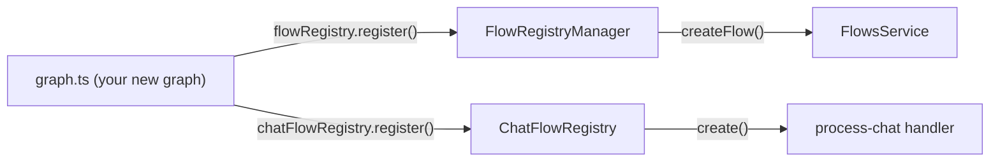
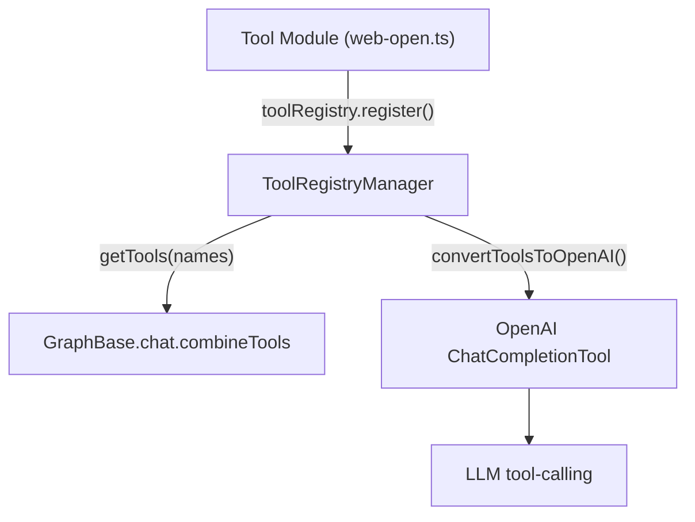
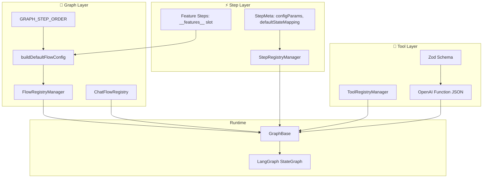

# 🧠 Customize Agents — Flows Architecture Guide

> A visual guide to Memorall's **three-layer extensibility model**: scalable graph types,
> unified tools, and composable steps/features.

---

## Overview

```
┌─────────────────────────────────────────────────────────────────────┐
│                         Agent Request                               │
└────────────────────────────┬────────────────────────────────────────┘
                             │
                             ▼
┌─────────────────────────────────────────────────────────────────────┐
│   ChatFlowRegistry  →  picks graph type  →  builds initial state    │
└────────────────────────────┬────────────────────────────────────────┘
                             │
         ┌──────┬──────────┴───────────┬──────┐
         ▼      ▼                     ▼      ▼
   ┌──────────────────────────────────────────────┐
   │         Any registered graph type            │
   │     (self-registered, zero central changes)  │
   └────────────────────┬─────────────────────────┘
                        │
   ┌────────────────────▼───────────────────────────┐
   │  Ordered Steps  (resolved from GRAPH_STEP_ORDER)│
   │                                                  │
   │  add-system → retrieve → [features] →           │
   │  agent-completion → chat-completion → citations  │
   └────────┬─────────────────────────────┬──────────┘
            │                             │
   ┌────────▼──────────┐       ┌──────────▼──────────┐
   │   StepRegistry    │       │    ToolRegistry      │
   │   (execution      │       │    (Zod schemas +    │
   │    units)         │       │     LLM functions)   │
   └───────────────────┘       └─────────────────────┘
```

---

## 🔷 Layer 1 — Scalable Graphs

### How graph types are registered

Every graph module **self-registers** using a singleton `FlowRegistryManager`.
Adding a new graph type requires **zero changes** to existing files.



**Self-registration pattern** (each graph does this once):

```ts
// 1. Implement the graph
class MyGraph extends GraphBase<...> { ... }

// 2. Register with flow registry (typed)
flowRegistry.register({
  flowType: "my-graph",
  factory: (services, config) => new MyGraph(services, config),
});

// 3. Register with chat registry (if chat-capable)
chatFlowRegistry.register("my-graph", (services, config) => ({
  graph: new MyGraph(services, config),
  getInitialState: (ctx) => ({ messages: ctx.messages }),
}));

// 4. Extend global type registry (TypeScript inference)
declare global {
  interface FlowTypeRegistry {
    "my-graph": { services: AllServices; config: MyConfig; flow: MyGraph };
  }
}
```

### The graph is fully yours

A graph is just a class extending `GraphBase`. Inside `graph.ts` you own the
**entire LangGraph `StateGraph`** — every node, every edge, every conditional
branch. There is no framework constraint on what the graph can do.

```
src/services/flows/graph/my-flow/graph.ts
─────────────────────────────────────────
  class MyFlow extends GraphBase {
    constructor() {
      super()

      // any topology you want:
      this.addNode("plan",    planNode)
      this.addNode("execute", executeNode)
      this.addNode("verify",  verifyNode)

      this.addEdge("plan", "execute")
      this.addConditionalEdges("execute", routeFn, {
        retry:  "execute",
        verify: "verify",
        done:   END,
      })
    }
  }
```

Linear chain, parallel fan-out, retry loops, dynamic branching — anything
LangGraph supports is available. Each graph is an independent unit.

### `GRAPH_STEP_ORDER` — a config convenience, not a constraint

`GRAPH_STEP_ORDER` exists only to drive **`buildDefaultFlowConfig()`** — it
generates the initial UI-editable step list with sensible defaults so users
don't start from a blank slate.

```
GRAPH_STEP_ORDER           →   buildDefaultFlowConfig()   →   UI config editor
(step names + order)           (StepInstanceConfig[])         (toggle / tweak steps)
```

It has **no influence over runtime graph topology**. A graph whose steps are
listed in `GRAPH_STEP_ORDER` can still wire those steps in any order, skip
some entirely, or add nodes that have no entry in the table at all.

If your graph needs no UI-driven config, you don't need an entry in
`GRAPH_STEP_ORDER` at all.

### Config lifecycle (when you do use it)

```
buildDefaultFlowConfig(graphType)
        │
        ▼
  canonical defaults ──────────────────────────────────────────┐
                                                               │
mergeWithDefaultConfig(saved, graphType)                       │
        │                                                      │
        ├─ match by id  (exact instance)                       │
        ├─ match by name (occurrence order)                    │
        └─ new steps not in saved → keep defaults  ◄──────────┘
           (zero-migration guarantee)
```

---

## 🔧 Layer 2 — Unified Tools

### Registration & type safety

All tools share the same contract: a **Zod schema** + an **execute function**.
The `ToolRegistry` stores them as factories and converts their schemas to
OpenAI-compatible function descriptors automatically.



**Unified tool contract:**

```ts
interface BaseTool {
  name:        string;           // "web_open"
  description: string;           // shown to the LLM
  schema:      z.ZodTypeAny;     // validates + describes parameters
  execute:     (input) => Promise<string>;
}
```

### Zod → JSON Schema → OpenAI

The `tool-registry.ts` converts Zod schemas transparently.
You write Zod; the LLM sees standard OpenAI function JSON.

```
z.object({                     →    { type: "object",
  url: z.string().url(),              properties: {
  timeoutMs: z.number()                 url:       { type: "string" },
    .optional(),                        timeoutMs: { type: "number" }
})                                    },
                                      required: ["url"]
                                    }
```

### Self-registration pattern (from `web-open.ts`)

```ts
const TOOL_NAME = "web_open" as const;

export const createWebOpenTool: ToolFactory<Input, WebToolServices> =
  (services): Tool<Input> => ({
    name: TOOL_NAME,
    description: "Open a web URL...",
    schema,
    execute: async (input) => { /* ... */ },
  });

// Side-effect registration
toolRegistry.register(TOOL_NAME, createWebOpenTool);

// TypeScript registry extension
declare global {
  interface ToolTypeRegistry {
    [TOOL_NAME]: { input: Input; services: WebToolServices };
  }
}
```

### Registered tool families

| Family | Examples |
|--------|---------|
| ⚙️ Utilities | `calculator`, `current_time`, `js_execute` |
| 📚 Knowledge | `knowledge_graph` |
| 📄 Documents | read, write, edit, move, remove, search |
| 🗂️ Filesystem | `fs_*` virtual file operations |
| 🐳 Sandbox | run code, servers, logs, package install |
| 🌐 Web browser | `web_open`, `web_read`, `web_wait`, DOM access |

---

## ⚡ Layer 3 — Scalable Steps & Features

### Step anatomy

A step is a **typed, reusable execution unit** with optional metadata that
drives both runtime behavior and UI generation.

```
StepMeta
 ├── description          → human label in UI
 ├── enabledByDefault     → on/off in fresh configs
 ├── defaultStateMapping  → auto-wires state fields to step inputs
 └── configParams[]
       ├── key            → config slot name
       ├── type           → string | number | boolean | array
       ├── default        → seed value in buildDefaultFlowConfig()
       └── description    → shown in config UI editor
```

`configParams` is the bridge between **stored config**, **UI form generation**,
and **step execution** — define it once, get all three for free.

### Step registration

```ts
stepRegistry.register(
  "my-step",
  (services: MyServices, config?: MyConfig) => bindStep(definition, services, config),
  {
    description: "Does something useful",
    enabledByDefault: true,
    defaultStateMapping: { messages: "messages", graphId: "graphId" },
    configParams: [
      { key: "maxTokens", type: "number", default: 2048,
        description: "Maximum tokens in the response" },
    ],
  },
);

declare global {
  interface StepTypeRegistry {
    "my-step": { input: MyInput; output: MyOutput;
                 services: MyServices; config: MyConfig };
  }
}
```

### Feature steps — the extensibility hook

Feature steps are a special catalog type. They live in the `__features__` slot
of `GRAPH_STEP_ORDER` and are injected automatically into every graph type that
supports them.

```
Feature step lifecycle:
─────────────────────────────────────────────────────────
  1. Registered in stepRegistry (like any other step)
  2. Added to DEFAULT_FLOW_STEPS with type="feature"
  3. getFeatureCatalogSteps() returns them at config-build time
  4. resolveStepOrder() splices them into __features__ slot
  5. At runtime they mutate graph state:
       messages  ← append capability system prompt
       tools     ← add tool names for this feature
─────────────────────────────────────────────────────────
```

**Built-in feature steps:**

| Step | Capability injected |
|------|---------------------|
| `web-feature` | Web browser tools + instructions |
| `nodejs-sandbox-feature` | Code execution sandbox |
| `fs-feature` | Workspace filesystem access |
| `documents-fs-feature` | Document filesystem access |

### Adding a new feature step

```
1. Create step module  src/services/flows/steps/features/my-feature.ts
        │
        ▼
2. Register in stepRegistry with type-safe factory + StepMeta
        │
        ▼
3. Add to DEFAULT_FLOW_STEPS catalog  (type: "feature")
        │
        ▼
4. Import from  src/services/flows/steps/index.ts
        │
        ▼
5. Users toggle it via FlowBuilderService.setFeatureEnabled()
           → stored in flow_configs as featureFlags
           → mergeWithDefaultConfig() picks it up automatically
```

---

## 🗺️ Full Picture



---

## Quick-start checklists

### ➕ New graph type
- [ ] Create `src/services/flows/graph/<name>/graph.ts`, extend `GraphBase`
- [ ] Define **any** nodes, edges, and conditions you need inside the constructor
- [ ] `flowRegistry.register(...)` + extend `FlowTypeRegistry`
- [ ] `chatFlowRegistry.register(...)` if chat-capable
- [ ] Import from `src/services/flows/graph/index.ts`
- [ ] _(optional)_ Add entry to `GRAPH_STEP_ORDER` only if you want UI-driven step config

### ➕ New tool
- [ ] Create `src/services/flows/tools/<family>/<name>.ts`
- [ ] Define Zod schema + `ToolFactory`
- [ ] `toolRegistry.register(TOOL_NAME, factory)` (self-register at file bottom)
- [ ] `declare global { interface ToolTypeRegistry { ... } }`
- [ ] Import from `src/services/flows/tools/index.ts`
- [ ] Add to relevant feature step catalog metadata if feature-gated

### ➕ New step / feature
- [ ] Create `src/services/flows/steps/<family>/<name>.ts`
- [ ] `defineStep(...)` + `bindStep(...)` factory export
- [ ] `stepRegistry.register(name, factory, meta)` with full `StepMeta`
- [ ] `declare global { interface StepTypeRegistry { ... } }`
- [ ] Import from `src/services/flows/steps/index.ts`
- [ ] If feature step: add to `DEFAULT_FLOW_STEPS` with `type: "feature"`
- [ ] If core step: add to `GRAPH_STEP_ORDER` for relevant graph types

---

## Related documents

- [Flows Service Reference](./flows-service.md) — full API surface and runtime details
- [LLM Service](./llm-service.md)
- [Database Service](./database-service.md)
- [Sandbox Container](./sandbox-container.md)
