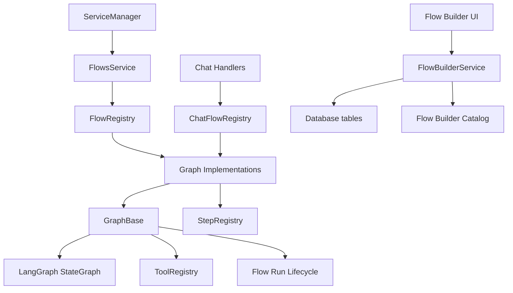

# Flows Service Documentation

## Overview

`src/services/flows` is the runtime package for Memorall's agent and knowledge workflows. It now includes five related layers:

- LangGraph-based flow execution (`FlowsService`, `flowRegistry`, graph classes)
- reusable typed steps (`stepRegistry`, `defineStep`, `bindStep`)
- reusable typed tools (`toolRegistry`, `convertToolsToOpenAI`)
- chat-flow adapters for generic chat entrypoints (`chatFlowRegistry`)
- database-backed flow-builder definitions, catalogs, configs, and feature flags (`FlowBuilderService`)

Registration is driven by side-effect imports from `src/services/flows/index.ts`:

```ts
import "./graph";
import "./steps";
import "./tools";
```

If a graph, step, or tool module is not imported somewhere under that tree, it is not registered at runtime.

## Architecture



## Public Entrypoint

`src/services/flows/index.ts` exposes the current public surface:

- `FlowsService`
- `stepRegistry`, `defineStep`, `bindStep`, and step typing helpers
- `toolRegistry`, `convertToolsToOpenAI`, and tool typing helpers
- `FlowBuilderService`
- `DEFAULT_FLOW_SERVICES`, `DEFAULT_FLOW_STEPS`, `getFlowCatalog()`, `findCatalogStep()`, and `findCatalogService()`

`chatFlowRegistry` is currently an internal adapter used by chat handlers rather than a public export from `index.ts`.

## Key Files

- `src/services/flows/index.ts` - package entrypoint and side-effect registration
- `src/services/flows/flows-service.ts` - runtime service facade
- `src/services/flows/flow-registry.ts` - flow registry singleton
- `src/services/flows/step-registry.ts` - step registry singleton
- `src/services/flows/tool-registry.ts` - tool registry singleton
- `src/services/flows/chat-flow-registry.ts` - chat-capable graph registry
- `src/services/flows/graph/graph.base.ts` - LangGraph base class and shared chat helpers
- `src/services/flows/graph/*/graph.ts` - concrete flow implementations
- `src/services/flows/flow-builder-service.ts` - persistent flow-builder API
- `src/services/flows/flow-builder-catalog.ts` - in-memory builder palette
- `src/services/flows/flow-builder-validation.ts` - structural validation for builder graphs
- `src/services/flows/runtime/run-lifecycle.ts` - run-scoped cleanup lifecycle

## Runtime Flow Layer

### FlowsService

`FlowsService` is a small facade over `flowRegistry`:

```ts
class FlowsService {
  async initialize(): Promise<void>

  createGraph<K extends keyof FlowTypeRegistry>(
    flowType: K,
    services: FlowTypeRegistry[K]["services"],
    config?: FlowTypeRegistry[K] extends { config: infer C } ? C : undefined,
  ): FlowTypeRegistry[K]["flow"]

  getRegisteredFlows(): string[]
  hasFlow(flowType: string): boolean
}
```

### Flow Registry

`flowRegistry` stores graph factories keyed by flow type. Each graph module self-registers and extends the global `FlowTypeRegistry` interface for type-safe creation.

Current registered flow types:

- `knowledge`
  - Entity/fact extraction pipeline for knowledge growth.
  - Composes registered steps such as `entity-extraction`, `entity-resolution`, `fact-extraction(-v2)`, `fact-resolution`, `edge-enrichment`, and `knowledge-database-save`.
  - Supports optional `enableTemporalExtraction` and `disableFactExtractionV2` config.
- `knowledge-rag`
  - Retrieval + response graph for chat over the knowledge base.
  - Supports `mode: "standard" | "quick" | "smart"`.
  - Supports `responseMode: "simple" | "agent"`.
  - Can inject feature steps, tools, and citations.
  - Uses `KnowledgeRAGConfig` including `tools`, `featureFlags`, `systemPrompt`, `contextPrompt`, `enableContextRetrieval`, and `enableCitations`.
- `agent`
  - Pure tool-calling graph with an LLM loop and `maxIterations`.
  - Uses `llm` plus the services implied by the configured tools.
  - Emits tool execution actions through the LangGraph writer stream.

### Chat Flow Registry

`chatFlowRegistry` is a second registry for "chat-capable" graphs. It currently has adapters for:

- `knowledge-rag`
- `agent`

It lets chat handlers ask for a graph by `graphType` without hard-coding per-flow branching. Unknown chat graph types fall back to `knowledge-rag`.

## GraphBase

All runtime graphs extend `GraphBase` from `src/services/flows/graph/graph.base.ts`.

Key responsibilities:

- owns the compiled LangGraph `StateGraph`
- provides `invoke()` and `stream()` wrappers
- injects and drains a per-run `FlowRunLifecycle`
- exposes shared chat helpers through `GraphBase.chat`
- normalizes chat message ordering so tool results follow their assistant tool calls
- combines registered tools with OpenAI-compatible tool descriptors

Base state fields shared by flow states:

```ts
interface BaseStateBase {
  messages: ChatCompletionMessageParam[];
  response?: string;
  tools: ToolName[];
}
```

Important helpers on `GraphBase.chat`:

- `systemMessage()` - merge or replace system prompts
- `assistantMessage()` - append an assistant response, optionally with tool calls
- `toolMessage()` - append tool execution output
- `addTool()`, `removeTool()`, `replaceTool()`, `clearTools()`
- `combineTools()` - resolve tool executors and OpenAI schemas from tool names

`invoke()` and `stream()` both attach a run lifecycle automatically. `stream()` wraps the async iterator so finish callbacks still drain on completion, error, or early termination.

## Step Layer

Steps are small reusable execution units that can be called directly or converted into LangGraph nodes.

### Step Registry

`stepRegistry` stores factories keyed by step name. A registered step can be retrieved in two ways:

- `getStep(name, services, config?)` for type-safe usage
- `getStepByName(name, services?, config?)` for dynamic usage

`bindStep()` returns a `BoundStep` with:

- `execute(input, runConfig?, metadata?)`
- `toNode({ mapInput, mapOutput, metadata, onExecuteStart })`

`toNode()` is the bridge between step I/O and graph state. It also forwards `runConfig.writer(...)` events and run lifecycle access into the step.

### Registered Step Families

The current codebase registers steps across these areas:

- `steps/common`
  - `add-system`
  - `chat-completion`
  - `agent-completion`
- `steps/knowledge-grow`
  - entity extraction/resolution
  - fact extraction/resolution
  - edge enrichment
  - temporal extraction
  - database save
  - entity/fact loading
- `steps/knowledge-retrieval`
  - query analysis
  - LLM/quick/smart retrieval
  - entity/fact to context
  - citation rendering
  - context-to-system prompt composition
- `steps/features`
  - retrieval composition helpers such as `context-smart-retrieve`
  - capability features that inject system instructions and tool names into graph state

Notable feature steps in the current catalog:

- `fs-feature`
- `documents-fs-feature`
- `documents-feature` (legacy)
- `nodejs-sandbox-feature`
- `web-feature`

These feature steps are used by `knowledge-rag` through `featureFlags`. Each one typically mutates:

- `messages` by appending a capability-specific system prompt
- `tools` by adding the relevant tool names

## Tool Layer

Tools are registered factories that produce executable tools with Zod schemas.

### Tool Registry

`toolRegistry` supports:

- `register(name, factory)`
- `getTool(name, services)`
- `getToolByName(name, services?)`
- `getTools(names, services?)`
- `getRegisteredToolNames()`
- `hasToolName(name)`
- `executeToolByName(name, args, services)`

`convertToolsToOpenAI()` converts registered Zod schemas into OpenAI `function` tool descriptors. This is what `GraphBase.chat.combineTools()` uses before LLM tool-calling.

### Registered Tool Families

The current package registers tools in these groups:

- basic utilities
  - `calculator`
  - `current_time`
  - `js_execute`
  - `knowledge_graph`
- document tools
  - read/search/write/edit/remove/move operations
- document filesystem tools
  - `fs_*` style virtual file operations for the document workspace
- workspace filesystem tools
  - `fs_*` style operations for workspaces
- sandbox container tools
  - run code, install packages, start/stop/restart/list servers, fetch resources, render/request pages, inspect logs, web access
- web browser tools
  - open/read/find-in-page/wait/DOM style browser session operations

Optional services used by tools and flows are part of `AllServices`:

```ts
interface AllServices {
  llm: ILLMService;
  embedding: IEmbeddingService;
  database: IDatabaseService;
  sandboxContainer?: ISandboxContainerService;
  webBrowser?: IWebBrowserService;
  documentFileSystem?: DocumentFileSystem;
}
```

## Flow Builder Layer

`FlowBuilderService` is separate from runtime graph creation. It persists user-defined builder data and predefined-flow settings in the database.

It currently handles:

- listing and loading saved flows
- creating, updating, and deleting flow definitions
- persisting flow states, services, steps, connections, and configs
- returning the in-memory builder catalog
- managing predefined flow config for `knowledge-rag`
- managing per-feature enable/disable flags as `feature` flow steps

Important detail: the builder catalog is in memory, not in the database.

### Flow Builder Catalog

`flow-builder-catalog.ts` defines:

- `DEFAULT_FLOW_SERVICES`
  - `llm`
  - `embedding`
  - `database`
- `DEFAULT_FLOW_STEPS`
  - common steps
  - retrieval steps
  - feature steps

Builder helpers:

- `getFlowCatalog()`
- `findCatalogStep(stepId)`
- `findCatalogService(serviceKey)`
- `getFeatureCatalogSteps()`

### Predefined Flow Config

The only predefined flow config currently modeled in code is `knowledge-rag`.

Config keys stored in `flow_configs`:

- `systemPrompt`
- `contextPrompt`
- `tools`
- `enableContextRetrieval`
- `enableCitations`
- `graphType`

Default predefined config:

```ts
{
  systemPrompt: "",
  contextPrompt: "",
  tools: ["current_time", "js_execute"],
  enableContextRetrieval: true,
  enableCitations: true,
  graphType: "knowledge-rag",
}
```

`graphType` is important for chat settings because it decides whether chat should instantiate the `knowledge-rag` graph or the pure `agent` graph.

### Validation

`validateFlowGraph()` in `flow-builder-validation.ts` currently performs structural checks only:

- empty graph
- missing start step
- missing end step
- dangling edges
- incoming edges to `__start__`
- outgoing edges from `__end__`

It does not compile or execute builder-defined graphs.

## Usage Example

Creating and streaming the current `knowledge-rag` graph:

```ts
const graph = flowsService.createGraph("knowledge-rag", services, {
  mode: "smart",
  responseMode: "agent",
  tools: ["current_time", "js_execute"],
  featureFlags: {
    "documents-fs-feature": true,
    "web-feature": true,
    "nodejs-sandbox-feature": true,
  },
});

const stream = await graph.stream(
  {
    messages,
    graphId: topicId,
    contextQueries: [],
    tools: ["current_time", "js_execute"],
  },
  {
    streamMode: ["custom", "values"],
  },
);

for await (const chunk of stream) {
  console.log(chunk);
}
```

## Adding a New Flow

1. Create a graph file under `src/services/flows/graph/<flow-name>/graph.ts`.
2. Extend `GraphBase` and compose nodes from `stepRegistry`.
3. Register the graph with `flowRegistry.register(...)`.
4. Extend the global `FlowTypeRegistry`.
5. Import the new module from `src/services/flows/graph/index.ts`.
6. If the graph should be used by generic chat handlers, also register it in `chatFlowRegistry`.

Minimal pattern:

```ts
flowRegistry.register({
  flowType: "my-flow",
  factory: (services, config) => new MyFlow(services, config),
});

declare global {
  interface FlowTypeRegistry {
    "my-flow": {
      services: AllServices;
      config: MyFlowConfig;
      flow: MyFlow;
    };
  }
}
```

## Adding a New Step

1. Create a step module under `src/services/flows/steps/...`.
2. Define the step with `defineStep(...)`.
3. Export a bound factory with `bindStep(...)`.
4. Register it in `stepRegistry`.
5. Extend the global `StepTypeRegistry`.
6. Make sure the module is imported somewhere during flow package initialization.
7. If it should appear in the builder palette, add it to `DEFAULT_FLOW_STEPS`.

Minimal pattern:

```ts
const definition = defineStep({
  name: "my-step",
  execute: async ({ input }) => ({ output: input }),
});

export const createMyStep = (services: MyServices, config?: MyConfig) =>
  bindStep(definition, services, config);

stepRegistry.register("my-step", createMyStep);
```

## Adding a New Tool

1. Create a tool module under `src/services/flows/tools/...`.
2. Define a Zod schema and `ToolFactory`.
3. Register it in `toolRegistry`.
4. Extend the global `ToolTypeRegistry`.
5. Import the file somewhere during flow package initialization.
6. If the tool should be enabled through a feature flag, add it to the relevant feature step and catalog metadata.

Minimal pattern:

```ts
export const createMyTool: ToolFactory<Input, MyServices> = (services) => ({
  name: "my_tool",
  description: "Example tool",
  schema,
  execute: async (input) => "done",
});

toolRegistry.register("my_tool", createMyTool);
```

## Operational Notes

- Registration failures are usually import failures. Check `src/services/flows/index.ts`, `src/services/flows/graph/index.ts`, and any transitive imports used by the catalog.
- `documents-feature` is marked legacy in the catalog. Prefer `documents-fs-feature` for new work.
- `web-feature` and `nodejs-sandbox-feature` currently re-export the v2 implementations.
- `GraphBase` stream lifecycles only clean up correctly if the async iterator is consumed or closed.
- `FlowBuilderService` persists builder definitions and settings, but runtime execution still comes from hand-authored graph classes under `src/services/flows/graph`.

## Related Documents

- [Database Service](./database-service.md)
- [Embedding Service](./embedding-service.md)
- [LLM Service](./llm-service.md)
- [Background Jobs](./background-jobs.md)
