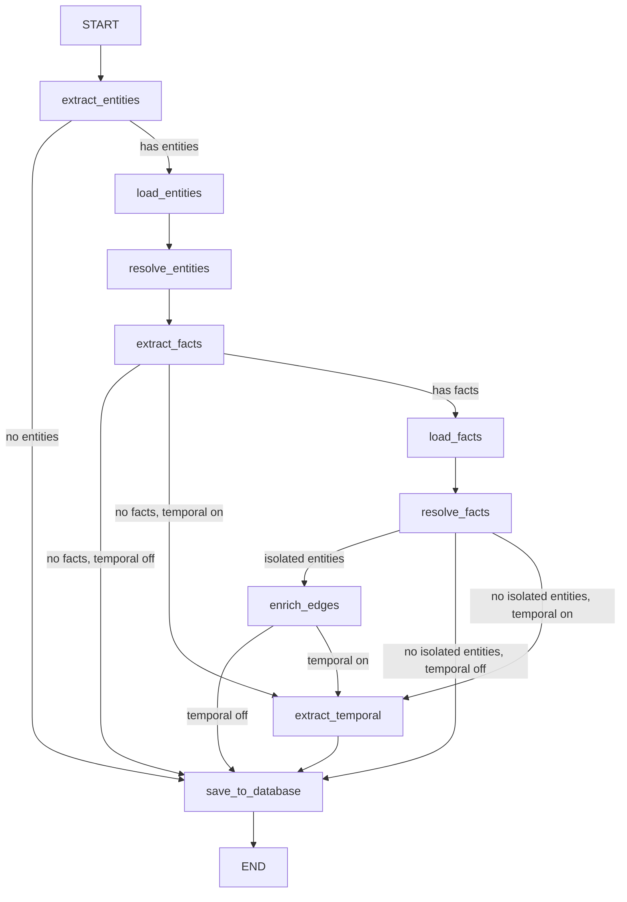

# Knowledge Graph Service and Flow

This document is the current source of truth for Memorall's knowledge graph pipeline. It replaces the older split between `knowledge-graph-service.md` and `knowledge-pipeline.md`.

## Overview

The current implementation is split into three layers:

- `KnowledgeGraphService`
  - Public entry point for file-to-graph conversion.
  - Creates or reuses the source record.
  - Tracks in-memory progress and exposes subscriptions.
  - Loads persisted graph data back by file path.
- `KnowledgeGraphFlow`
  - LangGraph workflow under `src/services/flows/graph/knowledge`.
  - Extracts entities and facts, resolves them against existing graph data, and persists new nodes and edges.
- `KnowledgeGraphHandler`
  - Background job wrapper under `src/services/background-jobs/handlers/process-knowledge-graph.ts`.
  - Relays `KnowledgeGraphService` progress into background job progress updates.

## Main Entry Points

```ts
class KnowledgeGraphService {
  subscribe(listener: (conversions: Map<string, ConversionProgress>) => void): () => void
  getKnowledgeGraphForPage(filePath: string): Promise<KnowledgeGraphData | null>
  convertPageToKnowledgeGraph(
    filePath: string,
    content: string,
    topicId?: string,
    isSpecificTextConversion?: boolean,
  ): Promise<void>
  convertMultiplePages(files: Array<{ filePath: string; content: string }>): Promise<void>
  getConversion(filePath: string): ConversionProgress | undefined
  getAllConversions(): ConversionProgress[]
  clearConversions(): void
  clearCompletedConversions(): void
}

interface KnowledgeGraphPayload {
  filePath: string
  content: string
  topicId?: string
  isSpecificTextConversion?: boolean
}

interface KnowledgeGraphConfig {
  enableTemporalExtraction?: boolean
  disableFactExtractionV2?: boolean
}
```

Key runtime behavior:

- `convertPageToKnowledgeGraph(...)` is keyed by `filePath` in the in-memory conversion map.
- A source row is ensured before the flow runs and is marked `processing`, then `completed` or `failed`.
- `convertMultiplePages(...)` is sequential and waits 1 second between files.
- `getKnowledgeGraphForPage(...)` loads the first matching source for the file and then resolves associated nodes and edges through `sourceNodes` and `sourceEdges`.

## Flow Topology

The current `KnowledgeGraphFlow` does not start by loading graph context. It starts by extracting entities from the input content and only loads existing data when that extraction produced something useful.



Current defaults:

- `enableTemporalExtraction` defaults to `false`.
- `fact-extraction-v2` is the default fact extraction step.
- Legacy `fact-extraction` runs only when `disableFactExtractionV2` is set to `true`.

## State Shape

The knowledge graph state carries:

- Input and source metadata:
  - `content`
  - `title`
  - `url`
  - `sourceId`
  - `sourceType`
  - `referenceTimestamp`
  - `metadata`
  - `graphId`
  - `isSpecificTextConversion`
- Message context:
  - `previousMessages`
  - `currentMessage`
- Working sets:
  - `extractedEntities`
  - `resolvedEntities`
  - `extractedFacts`
  - `resolvedFacts`
  - `enrichedFacts`
  - `existingNodes`
  - `existingEdges`
- Persistence output:
  - `createdNodes`
  - `createdEdges`
  - `createdSource`
- Status fields:
  - `processingStage`
  - `errors`

`KnowledgeGraphService` currently seeds the flow with file-oriented inputs:

- `title` and `url` are both set to the file path.
- `currentMessage` is the file path plus the raw file content.
- `sourceType` is `"file"`.
- `previousMessages` is `undefined`.
- `isSpecificTextConversion` is passed through from the caller.

## Stage-by-Stage Behavior

### 1. `extract_entities`

Implementation: `src/services/flows/steps/knowledge-grow/entity-extraction.ts`

Behavior:

- Uses one of three prompts:
  - standard extraction
  - user-input extraction
  - aggressive specific-text conversion
- Specific-text conversion is enabled by `isSpecificTextConversion === true`.
- User-input mode is available in the step, but the current file conversion entry path sets `sourceType` to `"file"`.
- Cleans extracted entity names before returning them:
  - removes simple wrappers and articles
  - normalizes URLs into cleaner entity names
  - converts first-person references to `Memorall User` in user-input and specific-text modes
- Deduplicates by lowercase entity name.
- If no entities are extracted, the graph skips directly to `save_to_database`.

### 2. `load_entities`

Implementation: `src/services/flows/steps/knowledge-grow/load-entities.ts`

Behavior:

- Builds search terms from extracted entity names.
- Scopes the search with `getScopedGraphWhere(...)`.
- Uses a three-tier search strategy with a total target of 200 nodes:
  - SQL `ILIKE` search: 60%
  - trigram search: 40%
  - vector search: fallback only
- Vector search is only attempted when SQL + trigram produce fewer than 50% of the target results and the embedding model is ready.
- Returns `existingNodes` for resolution and leaves edge loading to `load_facts`.

### 3. `resolve_entities`

Implementation: `src/services/flows/steps/knowledge-grow/entity-resolution.ts`

Behavior:

- Runs a manual exact-name pass first.
- Sends only the unmatched entities to the LLM.
- Uses `UuidMapper` so matched entities reuse existing IDs and new entities get stable generated UUIDs.
- Falls back to treating unresolved AI output as new entities when parsing fails.
- Returns `resolvedEntities` with:
  - `isExisting`
  - `existingId`
  - `finalName`

### 4. `extract_facts`

Default implementation: `src/services/flows/steps/knowledge-grow/fact-extraction-v2.ts`

Legacy implementation: `src/services/flows/steps/knowledge-grow/fact-extraction.ts`

Current default behavior:

- `fact-extraction-v2` batches entities based on the LLM context window:
  - `<= 4096` tokens: 3 entities
  - `<= 8192` tokens: 5 entities
  - `<= 16384` tokens: 8 entities
  - `<= 32768` tokens: 12 entities
  - larger models: 15 entities
- Each batch can use all resolved entities as context while prioritizing the current batch entities.
- Exact entity-name matching is enforced through a name-to-ID map.
- On JSON parse failure, a batch is retried in reduced mode with:
  - fewer contextual entities
  - shorter content
  - fewer retries
- After the main extraction pass, the step runs a second pass for still-unconnected entities.

### 5. `load_facts`

Implementation: `src/services/flows/steps/knowledge-grow/load-facts.ts`

Behavior:

- Starts from:
  - existing IDs from resolved existing entities
  - additional node IDs found through name matching for unresolved entities
- Uses a total target of 500 edges:
  - SQL edge search: 60%
  - trigram search: 40%
  - vector search: fallback only
- SQL search loads edges connected to candidate node IDs.
- Trigram search uses `relationType + factText` terms.
- Vector search is only attempted when SQL + trigram produce fewer than 50% of the target and embeddings are ready.
- If capacity remains, the step also loads extra edges that connect candidate entities to each other.
- Fetches any missing nodes referenced by the final edge set so fact resolution has node names available.

### 6. `resolve_facts`

Implementation: `src/services/flows/steps/knowledge-grow/fact-resolution.ts`

Behavior:

- Filters out facts whose entity UUIDs no longer map to `resolvedEntities`.
- Runs a manual duplicate pass first using:
  - source node ID
  - destination node ID
  - relation type
- Reverse source/destination keys are also inserted into the duplicate map.
- Sends only unresolved facts to the LLM.
- Uses `UuidMapper` to reuse existing edge IDs when possible.
- Returns `resolvedFacts`.

### 7. `enrich_edges`

Implementation: `src/services/flows/steps/knowledge-grow/edge-enrichment.ts`

Behavior:

- Runs only when `resolve_facts` leaves at least one isolated entity.
- Builds an isolated-node list from:
  - existing graph edges
  - resolved facts
- Asks the LLM for extra relationships involving those isolated nodes.
- Appends the new relationships to `extractedFacts`.

Important current limitation:

- The flow does not run another `resolve_facts` pass after `enrich_edges`.
- `knowledge-database-save` persists `resolvedFacts` or `enrichedFacts`, not `extractedFacts`.
- In the current implementation, `enrich_edges` can propose extra relationships, but those relationships are not fed back into the persisted edge set.

### 8. `extract_temporal`

Implementation: `src/services/flows/steps/knowledge-grow/temporal-extraction.ts`

Behavior:

- Disabled by default at the graph level.
- Runs only when `enableTemporalExtraction` is enabled in `KnowledgeGraphConfig`.
- Processes `resolvedFacts`, not raw extracted facts.
- Uses `referenceTimestamp` to convert relative dates into absolute values.
- Returns `enrichedFacts` with:
  - `temporal.validAt`
  - `temporal.invalidAt`

### 9. `save_to_database`

Implementation: `src/services/flows/steps/knowledge-grow/database-save.ts`

Behavior:

- Requires an existing `sourceId`.
- Uses `graphId?.trim() || "default"` for node and edge persistence scope.
- Creates nodes for `resolvedEntities` where `isExisting === false`.
- Stores node name embeddings when the embedding model is ready.
- Creates `sourceNodes` rows with relation `MENTIONED_IN`.
- Creates edges from:
  - non-existing `enrichedFacts`, if temporal extraction ran
  - otherwise non-existing `resolvedFacts`
- Stores fact embeddings and relation-type embeddings when available.
- Creates `sourceEdges` rows with relation `EXTRACTED_FROM`.
- Skips malformed or unmappable edges rather than failing the whole save step.

## Persistence Model

`KnowledgeGraphService` creates or updates the `sources` row before the flow runs.

Current source lifecycle:

- `pending`
  - only when `createSourceForPage(...)` is used explicitly
- `processing`
  - set by `convertPageToKnowledgeGraph(...)`
  - also set by the background job wrapper before it delegates to the service
- `completed`
  - set after a successful flow run
- `failed`
  - set on service or background-job failure

Entity and edge provenance:

- New nodes are linked back to the source with `sourceNodes.relation = "MENTIONED_IN"`.
- New edges are linked back to the source with `sourceEdges.relation = "EXTRACTED_FROM"`.
- `getKnowledgeGraphForPage(filePath)` reconstructs page-level graph data through those source link tables.

## Progress Tracking

`KnowledgeGraphService` keeps an in-memory `Map<string, ConversionProgress>` keyed by file path and notifies listeners on every update.

Current status values:

- `pending`
- `loading_existing_data`
- `extracting_entities`
- `resolving_entities`
- `extracting_facts`
- `resolving_facts`
- `extracting_temporal`
- `saving_to_database`
- `completed`
- `failed`

Current step-to-progress mapping:

| Source | Status | Stage | Progress |
| --- | --- | --- | --- |
| service initialization | `extracting_entities` | `Extracting entities...` | 10 |
| `load_entities` | `loading_existing_data` | `Loading related entities...` | 25 |
| `extract_entities` | `extracting_entities` | `Extracting entities...` | 30 |
| `resolve_entities` | `resolving_entities` | `Resolving entities...` | 45 |
| `extract_facts` | `extracting_facts` | `Extracting facts...` | 60 |
| `load_facts` | `loading_existing_data` | `Loading related facts...` | 70 |
| `resolve_facts` | `resolving_facts` | `Resolving facts...` | 75 |
| `extract_temporal` | `extracting_temporal` | `Extracting temporal information...` | 85 |
| `save_to_database` | `saving_to_database` | `Saving to database...` | 95 |
| final success | `completed` | `Completed successfully` | 100 |

The background job handler subscribes to the same conversion map and converts it into `JobProgressUpdate` records.

## Background Job Behavior

Implementation: `src/services/background-jobs/handlers/process-knowledge-graph.ts`

Behavior:

- Job type: `knowledge-graph`
- Payload:
  - `filePath`
  - `content`
  - `topicId?`
  - `isSpecificTextConversion?`
- Sets an initial job progress update at 5%.
- Subscribes to `KnowledgeGraphService` conversion updates by `filePath`.
- Delegates the actual work to `knowledgeGraphService.convertPageToKnowledgeGraph(...)`.
- On failure, updates the source status to `failed` by file path and rethrows.

## Current Implementation Notes

These are important if you are reading or changing the pipeline:

- `KnowledgeGraphFlow` starts at `extract_entities`, not `load_entities`.
- Temporal extraction is opt-in and disabled by default.
- Fact extraction v2 is the default path.
- `getKnowledgeGraphForPage(filePath)` returns the first matching source row for that file.
- `KnowledgeGraphService` only treats a `topicId` as a graph identifier for source creation when it is a valid UUID.
- `knowledge-database-save` falls back to `"default"` when `graphId` is empty.
- `ConversionProgress.stats.entitiesCreated` and `relationsCreated` are not populated by the current save-step output, because the service looks for `entitiesCreated` and `relationsCreated`, while `knowledge-database-save` returns `createdNodes` and `createdEdges`.

## Code Locations

- `src/main/modules/knowledge/services/knowledge-graph-service.ts`
- `src/services/flows/graph/knowledge/graph.ts`
- `src/services/flows/graph/knowledge/state.ts`
- `src/services/flows/steps/knowledge-grow/entity-extraction.ts`
- `src/services/flows/steps/knowledge-grow/load-entities.ts`
- `src/services/flows/steps/knowledge-grow/entity-resolution.ts`
- `src/services/flows/steps/knowledge-grow/fact-extraction-v2.ts`
- `src/services/flows/steps/knowledge-grow/fact-extraction.ts`
- `src/services/flows/steps/knowledge-grow/load-facts.ts`
- `src/services/flows/steps/knowledge-grow/fact-resolution.ts`
- `src/services/flows/steps/knowledge-grow/edge-enrichment.ts`
- `src/services/flows/steps/knowledge-grow/temporal-extraction.ts`
- `src/services/flows/steps/knowledge-grow/database-save.ts`
- `src/services/background-jobs/handlers/process-knowledge-graph.ts`
