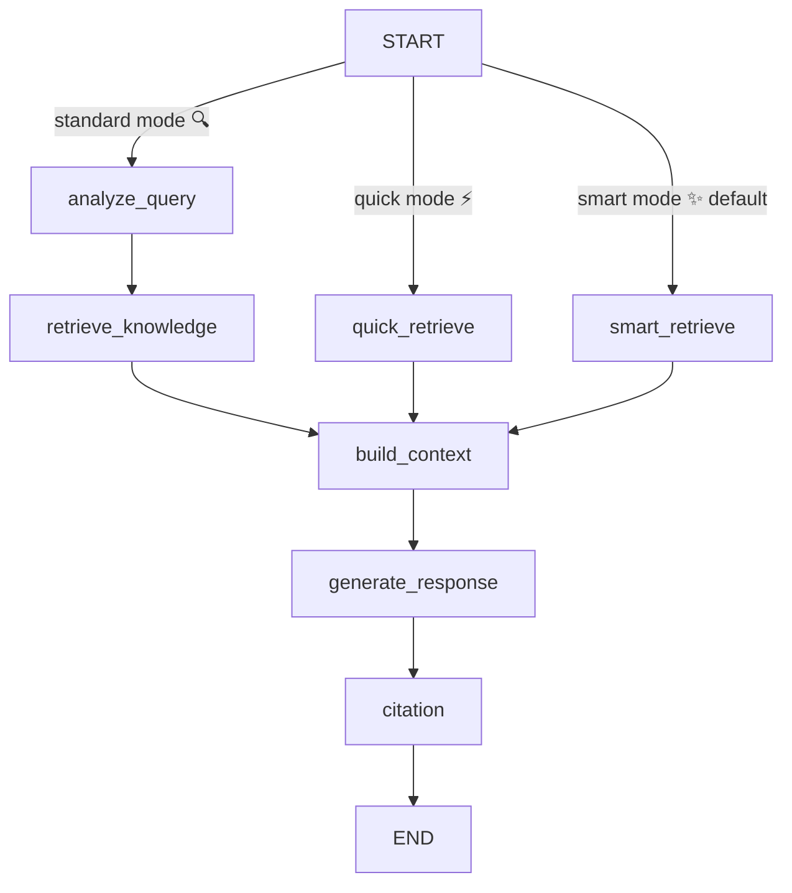

# 🧠 Knowledge RAG Flow Documentation

## 📋 Overview

The Knowledge RAG (Retrieval-Augmented Generation) Flow turns a user question into a grounded answer by analyzing the request, gathering related graph facts, packaging that context, and prompting an LLM. The flow is implemented in `src/services/flows/graph/knowledge-rag` and runs on top of the shared `GraphBase` utilities.

It exposes a configurable pipeline with **three operating modes**:

- **Smart mode** ✨ (default) - Hybrid 4-phase retrieval combining semantic search, intelligent graph expansion, completeness verification, and multi-factor ranking with MMR diversity optimization for best quality results.
- **Quick mode** ⚡ - Fast semantic search followed by graph growth to deliver breadth quickly, skipping LLM-based analysis.
- **Standard mode** 🔍 - Traditional LLM-based query analysis with SQL/trigram search and vector fallback for comprehensive but slower retrieval.

## ⚙️ Configuration

`KnowledgeRAGFlow` accepts an optional configuration object:

```typescript
interface KnowledgeRAGConfig {
  /** Retrieval mode: standard (LLM-based), quick (fast semantic), smart (hybrid - default) */
  mode?: "standard" | "quick" | "smart";
  maxGrowthLevels?: number;  // Used in quick mode (default: 3)
  searchLimit?: number;       // Used in quick mode (default: 50)
}
```

### Mode Selection

```typescript
// Use default smart mode
const flow = new KnowledgeRAGFlow(services);

// Explicitly set mode
const quickFlow = new KnowledgeRAGFlow(services, { mode: "quick" });
const standardFlow = new KnowledgeRAGFlow(services, { mode: "standard" });
```

### Smart Mode Configuration (Advanced)

Smart mode supports extensive configuration for fine-tuning retrieval behavior. See `SMART_RETRIEVAL_IMPLEMENTATION.md` and `MMR_USAGE_GUIDE.md` for details.

```typescript
const smartFlow = new SmartRetrievalFlow(services, {
  seed: {
    nodeLimit: 20,
    mmr: {
      enabled: true,
      mode: "balanced",  // or "focused", "explore", "custom"
    }
  },
  expansion: { maxLevels: 3 },
  completeness: { threshold: 0.8 },
  // ... more options
});
```

## 🏗️ Flow Structure



Each node logs its activity through the shared `actions` array, enabling downstream consumers to surface progress updates in the UI.

## 🔄 Processing Stages

### 🌟 Smart Mode (`smart_retrieve`) - **DEFAULT**

Smart mode executes a sophisticated 4-phase hybrid retrieval algorithm:

#### **Phase 1: Semantic Seed Retrieval** 🌱
- Embeds the user query once for efficient reuse
- Performs vector search for highly relevant nodes and edges
- **MMR (Maximal Marginal Relevance) diversity optimization**:
  - Fetches 2× candidates by default
  - Applies greedy selection algorithm to balance relevance and diversity
  - Configurable modes: `focused` (λ=0.8), `balanced` (λ=0.6, default), `explore` (λ=0.4)
  - Prevents redundant results while maintaining high relevance
- Filters by similarity thresholds (nodes: 0.5, edges: 0.4)
- **Output**: Diverse seed nodes and edges with high semantic relevance

**Example**: Query "React hooks" returns useState, useEffect, useContext, etc. instead of 5× useState docs.

#### **Phase 2: Smart Graph Expansion** 🌿
- Multi-level expansion (default: 3 levels) from seed nodes
- For each level:
  - Finds all edges connected to current frontier nodes
  - Extracts neighbor nodes
  - **Re-ranks neighbors by semantic similarity to original query**
  - Applies adaptive threshold decay per level (0.5 → 0.35 → 0.2)
  - Keeps only semantically relevant expansions
- Avoids duplicates and stops early if no new nodes added
- **Output**: Extended graph with semantically filtered context

**Key Innovation**: Unlike blind graph expansion, each neighbor is scored against the original query to prevent topic drift.

#### **Phase 3: Completeness Verification** ✅
- Extracts query components (keywords, bigrams, trigrams)
- Checks coverage: which components are found in retrieved nodes?
- If coverage < 80% (configurable):
  - Identifies missing components
  - Performs targeted retrieval for each gap
  - Adds gap-filling nodes with high coverage contribution
- Iterates up to 2 times (configurable)
- **Output**: Complete node set covering all query aspects

**Example**: Query "React hooks useEffect cleanup" ensures all three concepts are represented.

#### **Phase 4: Multi-Factor Re-Ranking** 🏆
- Calculates graph metrics:
  - **Centrality**: Degree centrality (normalized) - important hub nodes
  - **Density**: Edge count per node - well-connected nodes
- Computes final score for each node:
  ```
  finalScore =
    semanticScore    × 0.50 +  // Relevance to query
    centralityScore  × 0.20 +  // Importance in graph
    densityScore     × 0.15 +  // Well-connected nodes
    coverageScore    × 0.15    // Fills query gaps
  ```
- Sorts by final score and takes top 50 nodes (configurable)
- Filters edges to only connect top nodes, takes top 70 edges
- **Output**: Ranked, optimized results ready for context building

**Performance**: ~200-500ms for small graphs (<1000 nodes), ~500ms-2s for medium graphs.

**Learn More**: See `src/services/flows/graph/knowledge-rag/SMART_RETRIEVAL_IMPLEMENTATION.md` for detailed algorithm explanation and `MMR_USAGE_GUIDE.md` for MMR configuration.

---

### ⚡ Quick Mode (`quick_retrieve`)

Fast semantic search without LLM overhead, ideal for speed-critical scenarios:

1. **Semantic search** – vector-based search (`vectorSearchNodes` / `vectorSearchEdges`) with a 60/40 node/edge split using the default embedding model
2. **Graph growth** – iterative expansion (`growKnowledgeGraph`) that:
   - Gathers connected edges for the current node frontier
   - Fetches newly discovered nodes, capping each level (20 nodes, 30 edges per level)
   - Assigns diminishing relevance scores per level to prioritize closer information
3. The grown node/edge sets merge into normal `build_context` → `generate_response` stages, with intent defaulted to `factual`

**Use When**: Speed is critical and some redundancy is acceptable.

---

### 🔍 Standard Mode (`analyze_query` + `retrieve_knowledge`)

Traditional LLM-based pipeline for complex queries requiring entity extraction:

#### 1. Query Analysis (`analyze_query`)
- Uses the configured LLM service to run a JSON-format prompt (`QUERY_ANALYSIS_PROMPT`)
- Extracts an array of entity strings and one of four intents: `factual`, `relationship`, `summary`, or `exploration`
- If LLM output cannot be parsed, falls back to splitting query on whitespace (words > 3 characters) and defaults intent to `factual`
- Emits an action with the entities and intent for UI feedback

#### 2. Knowledge Retrieval (`retrieve_knowledge`)
High-recall entity and relationship discovery with layered fallbacks:

- **SQL search (60%)** – `LIKE` filters on node `name`/`summary` and edge `factText`, ordered by freshness
- **Trigram search (40%)** – PostgreSQL `pg_trgm` helpers with 0.1 similarity threshold
- **Vector fallback (up to 40%)** – triggered when SQL + trigram results are below half of target limit; uses cosine similarity against embeddings
- Result sets merged via `combineSearchResultsWithTrigram`, deduplicating by ID (15 nodes / 20 edges max)
- Missing nodes referenced by edges are fetched to maintain relationship integrity
- **Relevance scores**:
  - Nodes: +3 when name matches entity, +2 when summary matches
  - Edges: +2 when factText matches entities, +3/+1 if both/one endpoint is in node set

**Use When**: Query requires careful entity extraction or you need SQL/trigram hybrid search.

---

### 3. 🧩 Context Building (`build_context`)

Shared by all modes - transforms scored graph elements into model-ready artifacts:

- **Definitions** – `name: summary` pairs for each node
- **Facts** – sentences in the form `<source> <edgeType> <destination>, <factText>`
- Packages sections in XML-like wrapper: `<definitions>…</definitions>` and `<facts>…</facts>`
- Produces action with node/edge counts and full context for debugging

### 4. 🗣️ Response Generation (`generate_response`)

Shared by all modes - generates final answer:

- Validates LLM service is ready
- Interpolates `RESPONSE_GENERATION_PROMPT` with query and assembled context
- Requests streamed chat completion (`stream: true`, `temperature: 0.3`)
- Forwards chunks through optional callbacks while concatenating final answer
- Logs response and emits action with response length

### 5. 📎 Citation (`citation`)

Adds inline citations to the response:

- Splits answer into numbered lines
- Uses LLM to identify which knowledge sources were used per line
- Formats citations as markdown links: `[Label](#citations:node/uuid)`
- Merges citations back into original answer
- Supports tables by adding citations after table ends
- Falls back to original response if citation fails

## 🎯 Mode Comparison

| Feature | **Smart** ✨ | **Quick** ⚡ | **Standard** 🔍 |
|---------|-------------|-------------|----------------|
| **Speed** | Fast (~500ms-2s) | Fastest (~100-500ms) | Slow (~2-5s, LLM) |
| **Quality** | **Excellent** | Good | Very Good |
| **Semantic Understanding** | **Excellent** | Good | Partial (entity extraction) |
| **Graph Awareness** | **Smart (filtered)** | Yes (blind expansion) | No |
| **Completeness** | **Verified** | Partial | Good |
| **Diversity** | **High (MMR)** | Low (redundancy) | Medium |
| **Missing Info Detection** | **Yes** | No | No |
| **Ranking** | **Multi-factor** | Simple | Heuristic |
| **Best For** | **General use** | Speed priority | Complex entity queries |
| **Default** | ✅ **Yes** | No | No |

## 🛡️ Error Handling & Fallbacks

- Every node validates critical dependencies (`llm`, `database`, `embedding`) before work begins and throws with logged errors if requirements are unmet
- **Smart mode**: Phases 2-4 are optional; can proceed with just Phase 1 seeds if later phases fail
- **Standard mode**: Query analysis gracefully falls back to lexical parsing when JSON decoding fails
- **Quick mode**: Graph growth short-circuits if a level produces no new nodes
- Trigram and vector searches are wrapped in try/catch blocks for graceful degradation
- Citation node returns original response if citation generation fails
- Streaming response generation surfaces chunks while still returning aggregated string if streaming consumers are absent

## 📈 Operational Notes

- The flow relies on the shared `actions` array and `logInfo` / `logError` utilities for observability
- **Smart mode** provides detailed phase-by-phase statistics in the actions metadata
- Relevance scores are heuristic and meant for ordering only
- Keeping node and edge embeddings up to date is important for semantic modes (smart, quick) to remain effective
- **MMR diversity** is enabled by default in smart mode; adjust lambda if results are too diverse or too redundant

## ✅ Troubleshooting

### General Issues

- **Empty or low-quality results**:
  - Verify embeddings exist for nodes/edges
  - Check query components are sensible (inspect actions)
  - For standard mode: check extracted entities in Query Analysis action

- **Stale relationships**: Ensure related nodes carry summaries—missing summaries reduce scoring

- **Streaming issues**: If UI cannot handle streamed chunks, disable streaming at the caller layer

### Smart Mode Specific

- **Too much redundancy**: Lower MMR lambda (try `mode: "explore"` or custom lambda < 0.6)
- **Missing relevant results**: Higher MMR lambda (try `mode: "focused"` or custom lambda > 0.6)
- **Low coverage ratio**: Increase `completeness.threshold` or reduce `minComponentLength`
- **Slow performance**:
  - Reduce `expansion.maxLevels` (try 2 instead of 3)
  - Reduce `seed.nodeLimit` or MMR `candidateMultiplier`

### Mode-Specific Guidance

- **Use Smart mode (default)** for best overall quality
- **Use Quick mode** when speed is critical (e.g., autocomplete, preview)
- **Use Standard mode** when you need SQL/trigram search or explicit entity extraction

## 📚 Additional Documentation

- **Smart Retrieval Algorithm**: `src/services/flows/graph/knowledge-rag/SMART_RETRIEVAL_IMPLEMENTATION.md`
- **MMR Configuration Guide**: `src/services/flows/graph/knowledge-rag/MMR_USAGE_GUIDE.md`

---

This document reflects the behavior in `KnowledgeRAGFlow` as implemented in the source files under `src/services/flows/graph/knowledge-rag`.
