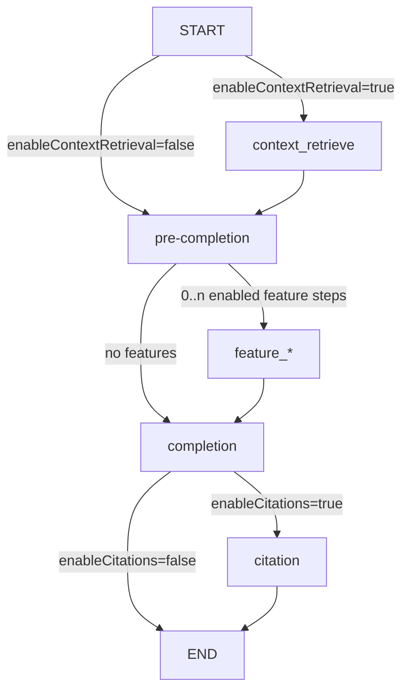

# Knowledge RAG Flow Documentation

## Overview

`KnowledgeRAGFlow` is the chat-oriented graph implemented in:

- `src/services/flows/graph/knowledge-rag/graph.ts`
- `src/services/flows/graph/knowledge-rag/state.ts`
- `src/services/flows/steps/knowledge-retrieval/*`
- `src/services/flows/steps/features/context-*.ts`

The current implementation is not just a retrieval pipeline. It is a configurable graph that can:

- optionally retrieve graph context,
- optionally add feature steps that mutate messages/tools,
- generate a response in either simple-chat or tool-using agent mode,
- optionally add line-level citations after completion.

## Current Graph Topology



Important points:

- `context_retrieve` is one wrapper step selected by `mode`.
- Feature steps run after retrieval and before completion.
- `completion` is `chat-completion` in `responseMode: "simple"` and `agent-completion` in `responseMode: "agent"`.
- `citation` is `entities-facts-citation`.

## Configuration

`KnowledgeRAGConfig` currently exposes:

```ts
interface KnowledgeRAGConfig {
  mode?: "standard" | "quick" | "smart";
  responseMode?: "simple" | "agent";
  tools?: `${ToolName}`[];
  maxIterations?: number;
  maxGrowthLevels?: number;
  searchLimit?: number;
  systemPrompt?: string;
  contextPrompt?: string;
  enableContextRetrieval?: boolean;
  enableCitations?: boolean;
  featureFlags?: Record<string, boolean>;
}
```

What each field actually does in the current code:

- `mode`
  - Default: `"smart"`.
  - Only matters when `enableContextRetrieval !== false`.
  - Selects one of `context-smart-retrieve`, `context-quick-retrieve`, or `context-llm-retrieve`.

- `responseMode`
  - Default: `"simple"`.
  - `"simple"` uses `chat-completion`.
  - `"agent"` uses `agent-completion`, which internally runs `AgentGraph`.

- `tools`
  - Relevant for agent mode and feature steps.
  - Passed into initial chat state by `chatFlowRegistry.register("knowledge-rag", ...)`.

- `maxGrowthLevels`, `searchLimit`
  - Only passed to `context-quick-retrieve` / `quick-retrieve`.

- `systemPrompt`
  - Used.
  - Overrides the default completion system prompt inserted before `completion`.

- `enableContextRetrieval`
  - Default: `true`.
  - When `false`, retrieval and context injection are skipped entirely.

- `enableCitations`
  - Default: `true`.
  - Controls whether the `citation` node is appended after completion.

- `featureFlags`
  - Used.
  - Each enabled catalog feature becomes a `feature_<name>` node between retrieval and completion.

- `contextPrompt`
  - Declared in the config type and supported by `context-to-system`.
  - Not currently wired by `KnowledgeRAGFlow`.
  - In practice, the graph always uses the default `context-to-system` prompt.

- `maxIterations`
  - Declared in the config type.
  - Not currently threaded into the graph's initial state by `KnowledgeRAGFlow` or its chat factory.
  - In agent mode, the effective limit is whatever `state.maxIterations` already is; the annotation default is `10`.

## Service-Facing Defaults

`state.ts` also defines the persisted/default UI config:

```ts
DEFAULT_KNOWLEDGE_RAG_PREDEFINED_CONFIG = {
  systemPrompt: "",
  contextPrompt: "",
  tools: ["current_time", "js_execute"],
  enableContextRetrieval: true,
  enableCitations: true,
  graphType: "knowledge-rag",
}
```

The canonical persisted keys are:

- `systemPrompt`
- `contextPrompt`
- `tools`
- `enableContextRetrieval`
- `enableCitations`
- `graphType`

`graphType` is a chat-layer setting. It decides whether chat instantiates the `knowledge-rag` graph or the separate pure `agent` graph.

## State Shape

`KnowledgeRAGState` keeps:

- `messages`
- `graphId`
- `contextQueries`
- `tools`
- `maxIterations`
- `extractedEntities`
- `queryIntent`
- `relevantNodes`
- `relevantEdges`
- `context`

Defaults from the annotation:

- `contextQueries = []`
- `maxIterations = 10`
- `extractedEntities = []`
- `queryIntent = "factual"`
- `relevantNodes = []`
- `relevantEdges = []`
- `context = ""`

## Chat Registration

`chatFlowRegistry.register("knowledge-rag", ...)` currently creates the flow with:

- `responseMode: "agent"`
- `systemPrompt`
- `contextPrompt`
- `enableContextRetrieval`
- `enableCitations`
- `tools`
- `featureFlags`

Initial state is seeded with:

- `messages`
- `graphId = topicId`
- `contextQueries`
- `tools`

It does not seed `maxIterations`.

## How Retrieval Query Text Is Chosen

All three context wrapper steps call `extractRetrievalTextFromMessages(...)`.

Priority:

1. latest user message text
2. latest non-empty message text
3. empty string

This means retrieval is driven from the live message list, not from a separate stored `query` field in graph state.

## Retrieval Wrappers

The graph does not directly chain `analyze-query -> llm-retrieve -> build-context -> generate-response`.

Instead, each mode uses one wrapper step that does retrieval, context formatting, and system-message injection in one node.

### Smart Mode: `context-smart-retrieve`

Wrapper sequence:

1. derive `query` from messages
2. run `smart-retrieve`
3. run `entities-facts-to-context`
4. run `context-to-system`

`smart-retrieve` currently implements these phases:

1. Primary query seed retrieval
   - vector search on the base query
   - node threshold `0.5`, edge threshold `0.4`
   - optional MMR on nodes

2. Context query seed retrieval
   - runs separate vector searches for each `contextQuery`
   - deduplicates by keeping the stronger semantic score per node/edge

3. Seed merge
   - merges primary-query and context-query seeds

4. Smart graph expansion
   - expands outward level by level
   - re-scores candidate nodes against the base query embedding
   - uses per-level thresholds from `levelThresholds` (default `[0.5, 0.35, 0.2]`)

5. Completeness verification
   - builds query components from the base query and all `contextQueries`
   - checks node coverage
   - gap-fills with more vector node searches when coverage is below threshold

6. Multi-factor re-ranking
   - combines semantic score, degree centrality, density, and coverage contribution
   - default weights:
     - semantic `0.5`
     - centrality `0.2`
     - density `0.15`
     - coverage `0.15`

7. Post-expansion
   - tries to connect standalone nodes by pulling in missing edges/nodes

Default smart config in code:

- seed nodes: `20`
- seed edges: `30`
- expansion levels: `3`
- output max nodes: `50`
- output max edges: `70`
- MMR enabled with mode `"balanced"` and candidate multiplier `2`

Important implementation details:

- Only smart mode uses `contextQueries`.
- Query components are built from both the base query and the extra context queries.
- Final edge filtering keeps edges where either endpoint is in the retained top-node set, not strictly both endpoints.

### Quick Mode: `context-quick-retrieve`

Wrapper sequence:

1. derive `query` from messages
2. run `quick-retrieve`
3. run `entities-facts-to-context`
4. run `context-to-system`

`quick-retrieve` behavior:

- vector search for nodes and edges using the default embedding
- 60/40 split between node and edge retrieval
- graph growth from seed nodes for `maxGrowthLevels` levels
- per-level limits:
  - `20` new nodes
  - `30` new edges
- grown items receive decaying relevance scores:
  - `0.8`, `0.6`, `0.4`, ... with floor `0.1`
- output `queryIntent` is always `"factual"`

Default quick config:

- `maxGrowthLevels = 3`
- `searchLimit = 50`

### Standard Mode: `context-llm-retrieve`

Wrapper sequence:

1. derive `query` from messages
2. run `analyze-query`
3. run `llm-retrieve`
4. run `entities-facts-to-context`
5. run `context-to-system`

`analyze-query`:

- prompts the LLM for JSON with:
  - `entities`
  - `intent`
- supported intents:
  - `factual`
  - `relationship`
  - `summary`
  - `exploration`
- if parsing fails, falls back to whitespace tokenization of words longer than 3 characters and defaults intent to `factual`

`llm-retrieve`:

- searches nodes with SQL `LIKE` on `name` and `summary`
- searches edges with SQL `LIKE` on `factText`
- runs trigram search for nodes and edges with threshold `0.1`
- uses vector fallback when SQL + trigram return less than half the target volume
- result caps:
  - nodes `15`
  - edges `20`
- fetches missing endpoint nodes for returned edges
- scores nodes and edges heuristically, then sorts descending by score

## Context Construction

`entities-facts-to-context` turns retrieved entities/facts into:

- `<definitions>...</definitions>`
- `<facts>...</facts>`

Format:

- definitions line:
  - `"Name" (Type): Summary.`
- facts line:
  - `"Source" edgeType "Destination", factText.`

It also emits two actions:

- `knowledge_graph`
- `context_knowledge`

Important current behavior:

- if there are no nodes or no edges, the step returns an empty context string
- this means node-only or edge-only retrieval does not produce partial context

## Context Injection

`context-to-system` prepends a system message containing:

- a `# Context` section
- a `<context>...</context>` wrapper
- instructions to prefer graph context first, then general knowledge if needed

The step supports a prompt override, but `KnowledgeRAGFlow` does not currently pass one in, so the default prompt is what the graph actually uses.

## Feature Steps

Feature steps are loaded from `getFeatureCatalogSteps()` and inserted after retrieval.

Current catalog entries for `knowledge-rag` include:

- `fs-feature`
- `documents-fs-feature`
- `documents-feature` (legacy)
- `nodejs-sandbox-feature`
- `web-feature`

Behavior:

- only enabled flags are added
- missing registry entries are skipped with a warning
- execution order follows catalog order, not user-supplied order
- feature steps can mutate `messages` and `tools`

## Completion Modes

### Simple Mode

`completion` uses `chat-completion` with:

- messages plus top-inserted system prompt
- `temperature: 0.2`
- `stream: true`

### Agent Mode

`completion` uses `agent-completion`, which:

- creates an internal `AgentGraph`
- passes through the current `tools`
- passes through `state.maxIterations`
- streams custom agent events and final values back to the caller

The default completion system prompt is:

- "You are a knowledgeable assistant."
- use provided system context
- use tools/features repeatedly when needed
- do not stop after a single failed or incomplete attempt

## Citations

When enabled, `entities-facts-citation` runs after completion.

Behavior:

- skips work if:
  - response is empty
  - there are no relevant nodes and no relevant edges
  - LLM is not ready
- asks the LLM to map answer lines to node/edge citations
- appends citations back onto matching lines
- avoids table rows and prefers adding citations after a table block
- on failure, returns the uncited response unchanged

Citation link shapes emitted by the prompt:

- node: `[Label](#citations:node/{uuid})`
- edge: `[Label](#citation:edge/{uuid})`

## Observability

The flow and steps emit action events through `runConfig.writer`.

Examples:

- `Query Analysis Complete`
- `Knowledge Retrieval Complete`
- `Quick Knowledge Retrieval Complete`
- `Context Quick Retrieve Complete`
- `Context Retrieve Knowledge Complete`
- `knowledge_graph`
- `context_knowledge`
- failure actions for wrapper and citation steps

The graph also logs initialization with:

- selected `mode`
- selected `responseMode`
- context retrieval enabled/disabled
- citation enabled/disabled
- configured tools
- enabled feature names

## Known Implementation Caveats

These are the current code realities and should be treated as implementation notes, not aspirational behavior:

- `contextPrompt` is defined but not wired into `KnowledgeRAGFlow`.
- `maxIterations` is defined in `KnowledgeRAGConfig` but not seeded into state by the chat factory.
- `entities-facts-to-context` requires both nodes and edges; otherwise context is empty.
- only smart mode uses `contextQueries`.
- simple mode still passes a `tools` field into the chat-completion node input, but `chat-completion` does not use it.

## Summary

The current `knowledge-rag` graph is best understood as:

1. optional retrieval-and-context injection
2. optional message/tool feature enrichment
3. response generation in simple or agent mode
4. optional citation post-processing

That is the behavior implemented today in `src/services/flows/graph/knowledge-rag` and `src/services/flows/steps/knowledge-retrieval`.
