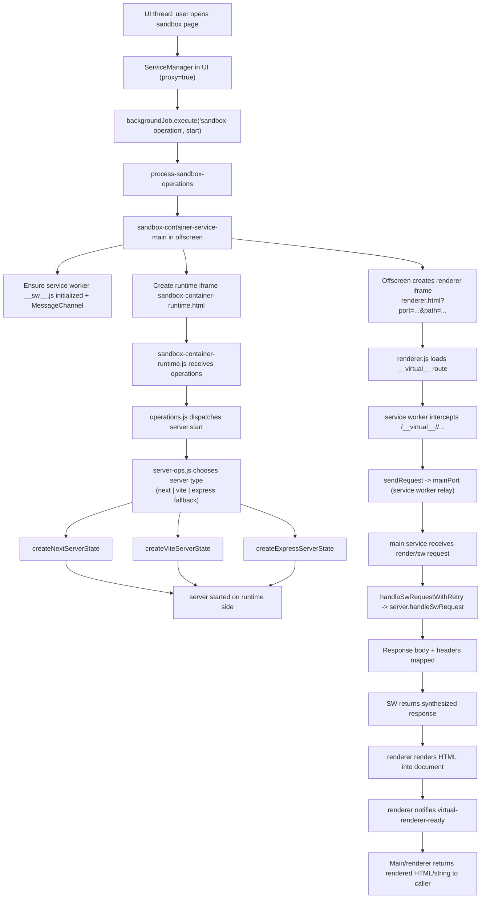
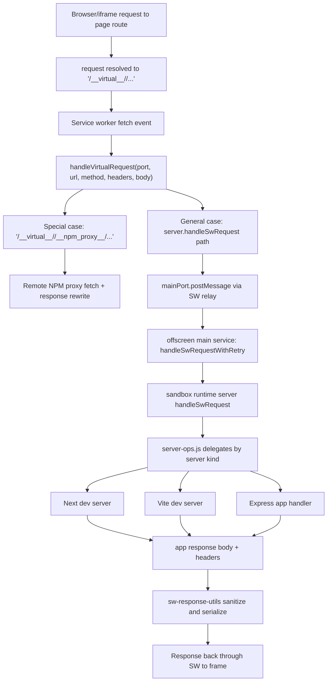

# Sandbox Container Architecture

This document captures the full sandbox container flow in this repository with emphasis on:

- thread responsibilities
- inter-thread communication
- UI rendering server path (iframe + service worker)
- HTTP/server request path (Vite / Next / Express fallback)
- proxy behavior in popup/standalone modes

It reflects the code paths in:
- `src/services/service-manager.ts`
- `src/services/sandbox-container/sandbox-container-service-proxy.ts`
- `src/services/background-jobs/handlers/process-sandbox-operations.ts`
- `src/services/sandbox-container/sandbox-container-service-main.ts`
- `src/services/sandbox-container/sw-response-utils.ts`
- `public/sandbox/__sw__.js`
- `public/sandbox/pages/sandbox-container-runtime.html`
- `public/sandbox/pages/sandbox-container-runtime.js`
- `public/sandbox/runtime/operations.js`
- `public/sandbox/runtime/server-ops.js`
- `public/sandbox/pages/renderer.html`
- `public/sandbox/pages/renderer.js`
- `public/sandbox/pages/renderer-utils.js`

## 1) Thread model and service selection

## 1.1 Why there are two threads

- **UI thread (popup/standalone pages)**: owns the user interface and sends sandbox requests.  
- **Main/offscreen context**: runs the heavy sandbox orchestration, runtime coordination, service worker registration, and rendering bridge.

In popup/standalone mode, the app initializes `ServiceManager` with `proxy: true`, so UI calls are wrapped into background jobs instead of directly touching runtime internals.

## 1.2 Service manager routing

1. UI components call sandbox service methods via `ServiceManager`.
2. `ServiceManager` dispatches to proxy implementations when `proxy` mode is enabled.
3. `sandbox-container-service-proxy` sends each operation through:
   - `backgroundJob.execute("sandbox-operation", { operation, payload })`
4. `process-sandbox-operations` receives the job, obtains `getSandboxContainerService()`, and invokes the corresponding runtime method.

This means UI thread never directly runs user-code heavy logic; it only orchestrates through message/job boundaries.

## 2) Communication contract across components

The system uses multiple channels:

- **Background job channel**: UI ↔ service-handler promise transport (`backgroundJob.execute`) for proxy mode.
- **Window messaging**: offscreen main service ↔ hidden runtime iframe (`sandbox-container-runtime.html`) via `postMessage` with request envelope.
- **MessageChannel relay**: main service ↔ service worker (`init`, `sw-needs-init`, request/response streams).
- **Virtual fetch channel**: Service worker intercepts requests at `/__virtual__/...` and forwards them to the main runtime service.
- **Renderer relay channel**: renderer iframe ↔ parent window (`sw-relay-request`, `sw-relay-response`) to keep SW and iframe isolated correctly.

## 3) UI Server flow (renderer path)

This is the path used to render project UI safely from the sandbox without exposing direct localhost ports to the UI thread.

### UI server behavior summary

- Renderer is not a full application server by itself.
- It is a controlled frame that pulls page output from the sandbox server via SW virtual routes.
- SW enforces header sanitization/corrections and import-map rewrites for safe rendering.
- This is why UI can show Vite/Next pages even though the actual server runs offscreen.

## 4) HTTP Server flow (runtime request path)

This covers ordinary browser-like HTTP requests made by the sandboxed app (page nav, assets, API calls).

### HTTP server behavior summary

- The runtime server (Vite/Next/Express) executes in the offscreen sandbox execution context.
- Requests are tunneled through SW virtual paths so they do not require direct network exposure from runtime to UI.
- For Vite and Next, dev server handles HMR and module loading via the same virtualized transport.
- For the Express fallback, runtime starts user server file first, then forwards each request through the same SW bridge.

## 5) Core orchestration details

### 5.1 Message envelope between main/offscreen and runtime iframe

The runtime iframe protocol uses:

- `channel`: `"memorall-sandbox-container"`
- `direction`: `"request"` / `"response"`
- `requestId`: unique correlation id
- `operation`: e.g. `server.start`, `server.request`, `server.handleSwRequest`
- `payload`

The main service keeps a pending map keyed by `requestId`, and resolves/rejects based on `status` in the response.

### 5.2 Service worker control and recovery

- SW is registered in main service and receives/ships messages via `MessagePort`.
- `init` message transfers relay port.
- `sw-needs-init` is sent from SW if a client contacts before main is attached.
- Main service listens for `controllerchange` and re-initializes the relay to keep requests working after SW updates or context changes.

### 5.3 Renderer message restoration

- `renderer.js` writes rendered HTML and script into the frame document.
- `renderer-utils.js` restores event listeners after document replacement.
- It emits `virtual-renderer-ready` when render is done and snapshots final html when needed by host.

### 5.4 Retry and workspace materialization

- `handleSwRequestWithRetry` handles transient request failures (e.g., when mounted workspace files are not ready).
- It attempts a retry after forcing workspace and document file initialization before giving up.

## 6) Distinction: sandbox HTTP server vs AI provider HTTP

It is important to separate:

- **Sandbox runtime server path (this document)**  
  Vite/Next/Express inside the sandbox container, invoked with `server.*` operations, and rendered through SW + iframe.

- **LLM/provider HTTP path**  
  Chat/embedding/model calls use normal HTTPS fetches to configured provider-compatible endpoints (OpenAI-like APIs), which are not part of this sandbox SW virtual routing path.

When you hear "http/express" in this codebase, verify the context:

- If call site is under sandbox container `server-ops`, it refers to user project dev server behavior.
- If call site is under LLM provider client classes, it refers to model inference APIs.

## 7) Failure modes to be aware of

- Missing or stale service worker channel -> `sw-needs-init` / relay rebind.
- Inconsistent mount state -> render requests may fail until file materialization retry occurs.
- Request timing race -> response missing/late requestId due to message ordering; handled via promise map and status checks.

## 8) Minimal mental model

1. UI never directly starts user servers.  
2. It always asks the proxy service to request operations.  
3. Offscreen main runs sandbox runtime and keeps a relay.  
4. SW virtualizes all server-facing browser traffic.  
5. Renderer iframe consumes virtual responses and displays content.
