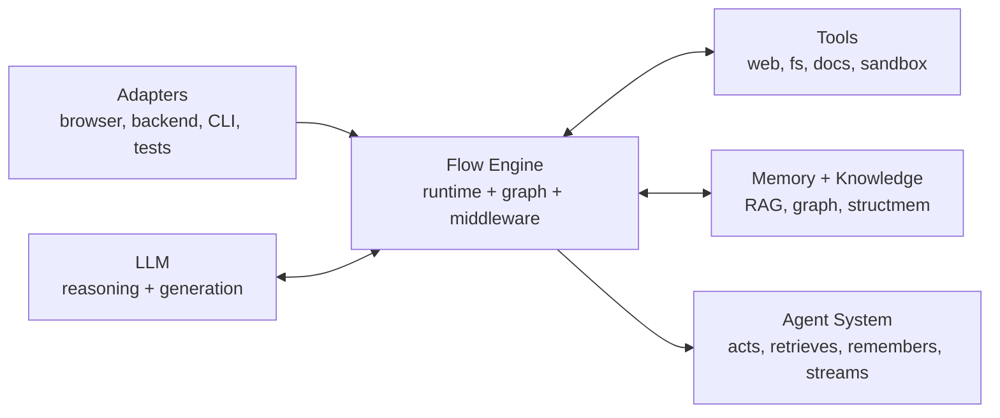
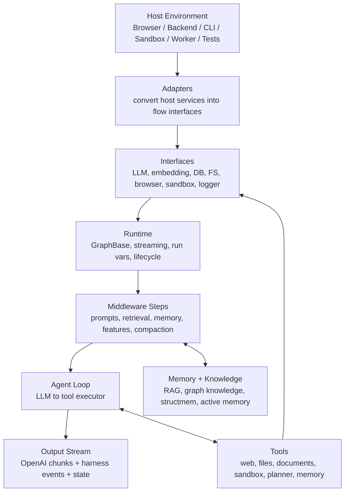
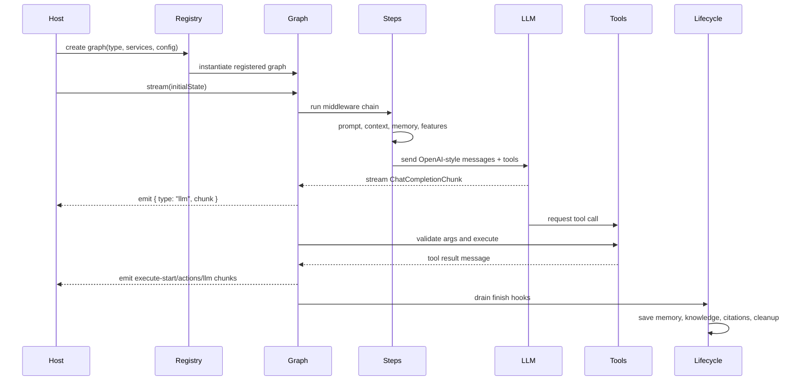
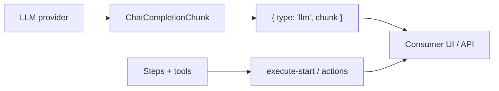
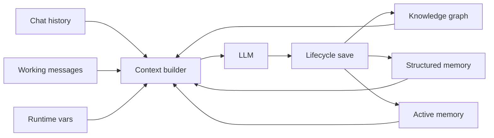
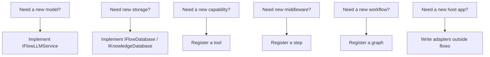

# Flow Engine


`src/services/flows` is the Flow Engine: a portable harness system for building LLM applications that can reason, use tools, retrieve memory, stream progress, and run across many host environments.

The important idea is that the LLM is not the application. The Flow Engine is the harness around the LLM. It owns the repeatable system behavior: graph execution, middleware, tool calling, memory, knowledge retrieval, streaming, lifecycle hooks, and host adapters.

```text
LLM alone          -> text prediction
LLM + Flow Engine  -> explorable agent system

Flow Engine = runtime + graph + middleware + tools + memory + knowledge + adapters
```

## Why This Exists

The Flow Engine is built for agent systems that need to grow without turning into one large, hard-coded prompt loop.

| Goal | How the Flow Engine supports it |
|---|---|
| **Scalable** | Capabilities are split into graphs, steps, tools, features, adapters, and services instead of one monolithic agent |
| **Explorable** | Registries and catalogs make available graphs, steps, tools, and feature bundles discoverable by code and UI |
| **Portable** | Hosts provide adapters; the harness stays independent of Electron, browser APIs, server APIs, and concrete databases |
| **Composable** | Middleware steps can be rearranged to build chat, tool agents, RAG, memory agents, extraction flows, and test flows |
| **Testable** | LLMs, embeddings, filesystems, databases, browser sessions, and sandboxes can be replaced with fakes |
| **Streamable** | Output is OpenAI-compatible chunks plus richer harness events for progress, tools, retrieval, and graph state |

## At A Glance

| | What it means |
|---:|---|
| **LLM harness** | Wraps the model with runtime logic, memory, tools, streaming, and lifecycle behavior |
| **Workflow engine** | Runs graph-based flows, middleware chains, and model/tool loops |
| **Standard interfaces** | Uses portable contracts for LLM, embeddings, DB, FS, browser, sandbox, logger, and documents |
| **Wide environment support** | Runs in browser, backend, CLI, sandbox, worker, edge, and tests through adapters |
| **Explorable registries** | Graphs, steps, tools, and features are registered instead of hidden in one implementation |
| **OpenAI-compatible streaming** | Streams `ChatCompletionChunk` payloads plus harness events |

## The Big Picture



The LLM is the reasoning core. The Flow Engine decides what context the model sees, which tools are available, how tool calls execute, how output streams, and what should be saved after the run.

## Core Principles

### 1. Run Everywhere

The engine must not be tied to Electron, a browser API, a database client, or a server framework.

| Environment | Example usage |
|---|---|
| **Browser** | UI agents, browser storage, web sessions, remote LLM/database adapters |
| **Backend** | APIs, background jobs, server DBs, `fs/promises`, server logging |
| **CLI** | Local automation, scripts, developer workflows |
| **Sandbox** | Code execution, package installs, file generation, preview servers |
| **Worker / edge** | Fetch-based adapters and lightweight storage bindings |
| **Tests** | Fake LLM, in-memory DB, in-memory FS, deterministic embeddings |

The host provides adapters. The Flow Engine stays portable.

### 2. Use Standard Interfaces

The engine talks to the outside world through stable contracts:

| Interface | Purpose | Standard shape |
|---|---|---|
| `IFlowLLMService` | Chat completions and streaming | OpenAI-compatible `chat.completions.create()` |
| `IFlowEmbeddingService` | Embeddings | OpenAI-compatible `embeddings.create()` |
| `IFlowFileSystem` | Files | Node `fs/promises`-style methods |
| `IFlowDatabase` | General persistence | Collection/repository pattern |
| `IKnowledgeDatabase` | Graph knowledge | Nodes, edges, sources through an adapter |
| `IFlowWebBrowserService` | Web sessions | Open/read/search/action contract |
| `IFlowSandboxService` | Isolated execution | Commands, code, files, packages, servers |
| `IFlowLogger` | Logging | `console`-compatible methods |
| `IDocumentProcessor` | Documents | Host-provided extraction/formatting |

No application schema belongs in the harness. The application adapts its real services into these interfaces.

### 3. Customize Every Layer

The engine is not one hard-coded agent. It is a set of composable layers.

| Extension point | What you customize | Example |
|---|---|---|
| **Graph** | Workflow topology | agent loop, RAG flow, knowledge extraction, custom pipeline |
| **Step** | Middleware behavior | add system prompt, retrieve context, enable tools, save memory |
| **Tool** | Model-callable action | web search, file edit, sandbox execute, memory remember |
| **Adapter** | Environment binding | OpenAI, local model, Postgres, in-memory DB, browser FS |
| **Lifecycle hook** | Side effects around a run | save citations, persist memory, cleanup resources |
| **Feature** | Configurable capability bundle | web feature, sandbox feature, active-memory feature |

## Layer Stack



## What You Can Build

| Use case | Layers used |
|---|---|
| **Simple chat** | LLM interface + chat completion step + streaming |
| **Tool agent** | Agent graph + tool registry + tool executor |
| **Knowledge RAG** | Retrieval steps + knowledge DB adapter + context middleware |
| **Memory agent** | Active memory tools + structmem steps + lifecycle save hooks |
| **Web agent** | Web feature + browser adapter + web tools |
| **Workspace agent** | FS adapter + file tools + document processor |
| **Coding sandbox agent** | Sandbox adapter + command/server/package tools |
| **Knowledge extraction pipeline** | Knowledge graph + entity/fact extraction steps |
| **Deterministic tests** | Fake LLM + in-memory DB/FS + deterministic embeddings |

## How Execution Works



## Middleware Steps

Steps are middleware nodes. They shape the run before, during, or after model calls.

```text
input state -> step -> updated state -> next step
```

Examples of what a step can do:

| Step kind | What it does |
|---|---|
| Prompt step | Add, replace, or compose system prompts |
| Retrieval step | Load relevant facts, nodes, edges, citations, documents |
| Memory step | Retrieve structured memory or register memory save hooks |
| Feature step | Enable tool bundles such as web, FS, sandbox, planner |
| Compaction step | Reduce long history before the LLM call |
| Runtime step | Read/write run-scoped variables |
| Lifecycle step | Save knowledge, memory, or citations after streaming finishes |
| LLM step | Call the model directly or delegate to the agent loop |

Steps make behavior composable. You can build a new agent by rearranging middleware instead of rewriting the runtime.

## Tools

Tools are model-callable capabilities.

```text
tool = name + description + Zod schema + executor + injected services
```

The Flow Engine handles the hard parts:

1. Convert tool schemas to OpenAI tool definitions.
2. Send tools to the model.
3. Receive streamed tool-call deltas.
4. Parse and validate arguments.
5. Execute the tool with injected services.
6. Stream progress and result chunks.
7. Append the result as a tool message.
8. Continue the model/tool loop.

Tool families:

| Family | Examples |
|---|---|
| Web | search, open, read, wait, DOM action, screenshot |
| Filesystem | read, write, edit, grep, glob, list, mkdir, remove |
| Documents | PDF text, metadata, conversion, extraction |
| Sandbox | run code, execute command, install package, start server, logs |
| Knowledge | read graph, write graph, explain source |
| Memory | remember, retrieve, update, remove |
| Planner | create plan, add item, check item |
| Co-agent | click, input, observe, query, scroll |

## Streaming Output

The Flow Engine streams **OpenAI-compatible LLM chunks** and **harness events** through the same graph stream.



### Stream Event Types

```ts
type FlowCustomChunk =
  | { type: "llm"; chunk: ChatCompletionChunk }
  | { type: "actions"; actions: FlowAction[] }
  | {
      type: "execute-start";
      node: string;
      metadata?: Record<string, unknown>;
    }
  | { type: string };
```

| Event | Use it for |
|---|---|
| `llm` | Assistant text, tool-call deltas, assistant/tool messages |
| `execute-start` | Show which step or tool just started |
| `actions` | Show retrieval, memory, knowledge, or feature activity |
| `values` mode | Read graph state snapshots when enabled |
| `updates` mode | Read node-level state updates when enabled |

The result: a simple client can read only `llm` chunks. A rich client can also render progress, tool execution, retrieval breadcrumbs, and graph state.

## OpenAI Compatibility

The model boundary is OpenAI-shaped:

```ts
services.llm.chatCompletions({
  messages,
  tools,
  tool_choice: "auto",
  stream: true,
});
```

Preferred provider shape:

```ts
services.llm.chat?.completions.create({
  messages,
  tools,
  stream: true,
});
```

The harness uses OpenAI-style types:

- `ChatCompletionMessageParam`
- `ChatCompletionRequest`
- `ChatCompletionResponse`
- `ChatCompletionChunk`
- `ChatCompletionTool`
- `ChatCompletionMessageToolCall`

That makes it compatible with OpenAI, OpenAI-compatible proxies, local model servers, hosted gateways, and deterministic test fakes.

## Memory And Knowledge

The harness supports more than chat history.



| Memory layer | Purpose |
|---|---|
| Chat history | Stable committed conversation messages |
| Working messages | In-progress assistant/tool messages during a loop |
| Runtime vars | Per-run transient data |
| Knowledge graph | Durable entity/fact graph scoped by graph id |
| Structured memory | Event-style memory and consolidation |
| Active memory | Tool-accessible remembered facts |
| Retrieval context | Selected facts, nodes, edges, citations, and summaries |

## Explorable Registries

The Flow Engine is designed so hosts and builder UIs can inspect what exists instead of relying on hidden code paths.

| Registry / catalog | What it exposes |
|---|---|
| `flow-registry.ts` | Available graph implementations |
| `chat-flow-registry.ts` | Chat-oriented graph selection |
| `step-registry.ts` | Middleware steps that can shape a run |
| `tool-registry.ts` | Model-callable tools and their schemas |
| `feature-catalog-registry.ts` | Configurable feature bundles |
| `flow-builder-catalog.ts` | Builder-facing metadata for constructing flows |

This is what makes the harness explorable: a host can show available capabilities, validate configs, and build flows without hard-coding every option into the UI.

## Customization Map



| Goal | Extension point |
|---|---|
| Change model provider | `IFlowLLMService` adapter |
| Change embedding provider | `IFlowEmbeddingService` adapter |
| Change filesystem | `IFlowFileSystem` adapter |
| Change database | `IFlowDatabase` / `IKnowledgeDatabase` adapter |
| Add web/browser ability | `IFlowWebBrowserService` adapter + web tools |
| Add sandbox ability | `IFlowSandboxService` adapter + sandbox tools |
| Add model-callable action | Tool registry |
| Add prompt/context/memory behavior | Step registry |
| Add a new workflow topology | Flow graph registry |
| Add configurable feature bundle | Feature catalog registry |

## Quick Usage Shape

```ts
import {
  registerBuiltins,
  chatFlowRegistry,
  consoleFlowLogger,
  type AllServices,
} from "@memorall/flows";

registerBuiltins();

const services: AllServices = {
  llm,
  embedding,
  database,
  logger: consoleFlowLogger,
  fs,
  webBrowser,
  sandboxContainer,
};

const graph = chatFlowRegistry.create("agent", services, {
  tools: ["current_time", "web_search", "fs_read"],
  maxIterations: 8,
});

const stream = await graph.stream(
  {
    messages,
    tools: ["current_time", "web_search", "fs_read"],
  },
  {
    streamMode: ["custom", "values"],
  },
);
```

## Boundary Rules

These rules keep the Flow Engine reusable:

| Rule | Why it matters |
|---|---|
| Interfaces stay standard | Any host can implement them |
| App services enter through adapters | `flows` stays independent |
| App schemas stay outside `flows` | No product-specific lock-in |
| Tools and steps use `AllServices` | Dependencies stay explicit |
| Filesystem APIs follow `fs/promises` | Works in Node and virtual FS implementations |
| Knowledge uses `IKnowledgeDatabase` | Graph behavior is typed without importing app DB code |
| New behavior is registered | The runtime stays modular |

## One-Line Definition

**Flow Engine is a scalable, explorable, portable harness system that wraps an LLM with graph execution, middleware, tools, memory, knowledge, OpenAI-compatible streaming, lifecycle hooks, and environment adapters.**
